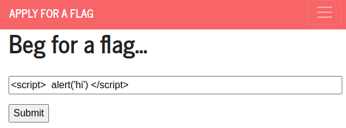
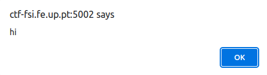
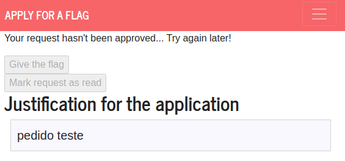
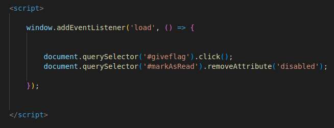
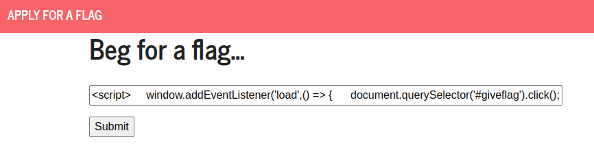
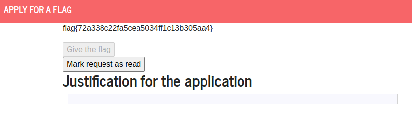
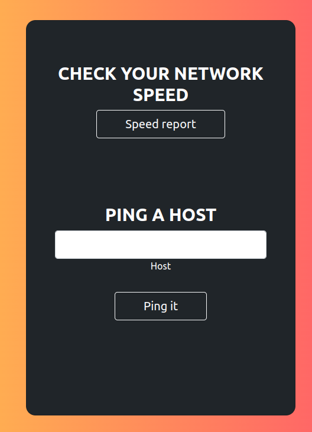
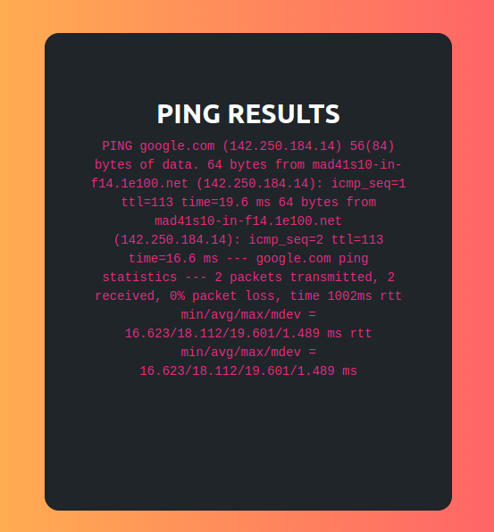
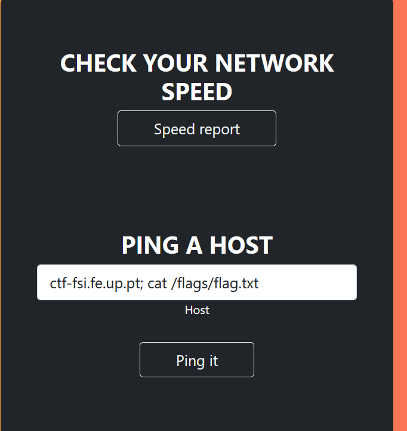
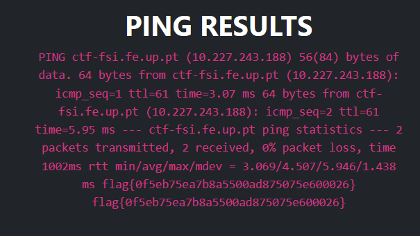

# Semana 10

## Desafio 1

Neste desafio reparamos rapidamente que um ataque XSS era possível:

Vamos então explorar esta vulnerabilidade para alcançar a flag.
Nós sabemos que a página de admin é a mesma que a do utilizador. A única coisa que muda do ponto de vista do admin são os botões que são clicáveis para ele tomar a decisão. Essa decisão é depois apresentada passados uns 5s ao utilizador.

O ataque é bastante simples. Já sabemos que o código Javascript que vemos ser executado como o alert prompt vai também ser executado na janela do admin. Assim,vamos criar um Javascript listenner que ao ser carregado na página do admin vai clicar automaticamente no botão de aprovar o pedido. Para tal, basta fazermos um Load Event Listener e usar um querySelector para selectionar o botão e forçá-lo a ser clicado.
Pondo o ataque em prática temos:

E conseguimos então a flag:

## Desafio 2

Entrando no site,vemos que é possível fazer login, fazer um teste à velociadade da net e dar ping de um host. Vamos averiguar a funcionalidade de ping. Através dela é possível indicar um site e um ping é feito, assemelhando-se ao comando `ping` de uma consola shell.

Para dar ping de um host quase de certeza que é utilizado o utilitário ping do Linux. Se a string por nós escrita não for devidamente tratada/filtrada quando é enviada para a command line, isso dá nos controlo dos comandos a serem executados.

Ao testar se o ponto anterior de facto ocorria chegou-se à solução do desafio.

A ideia passa por chamar um comando por nós pretendido, neste caso cat /flags/flag.txt. Uma vez que a string dada de input é por nós controlada podemos correr multiplos comandos!

Note-se também que é possível chegar à solução sem sequer chegar a abrir o site para introduzir o input visto a string de input ser passada no URL. Assim, qualquer pessoa com o seguinte link consegue obter diretamente a flag:

http://ctf-fsi.fe.up.pt:5000/tools/ping.php?target=%3Bcat+%2Fflags%2Fflag.txt

