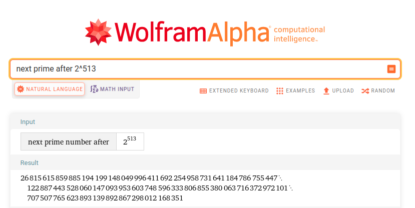
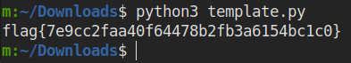
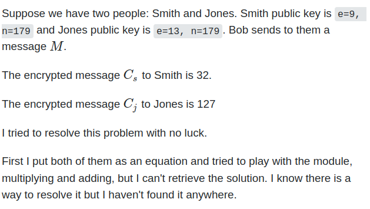
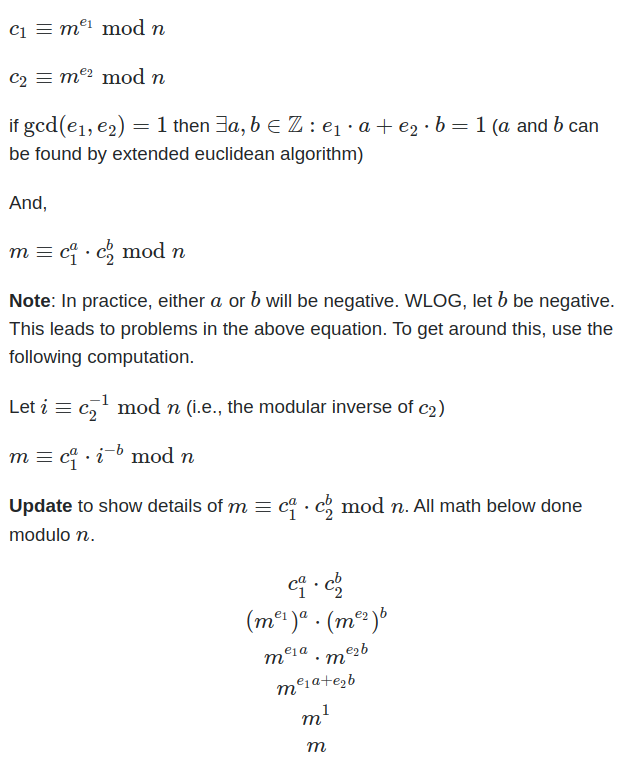
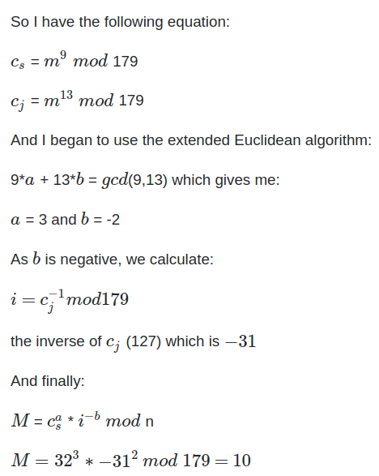
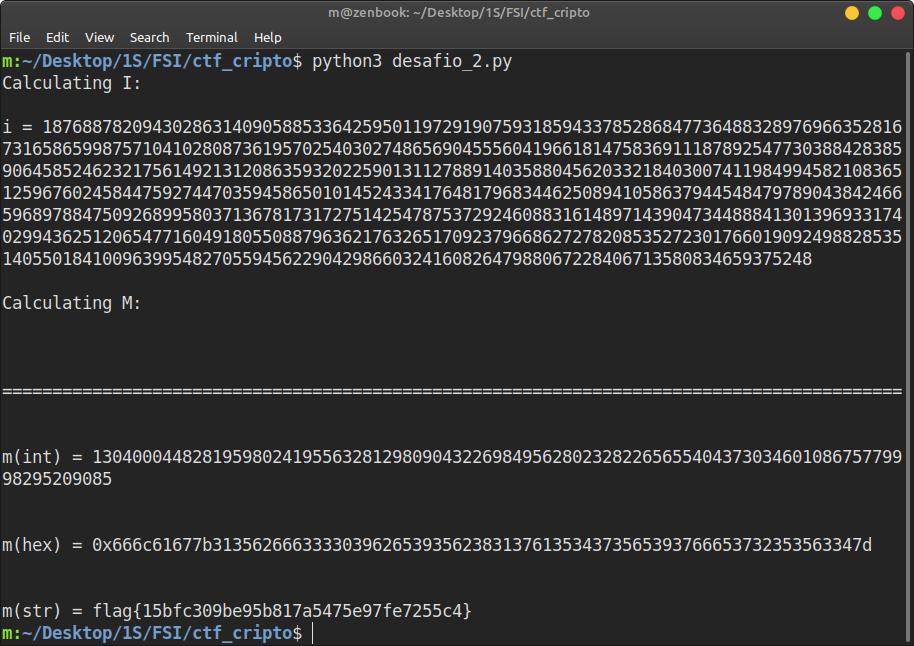

# Semana 12

## Desafio 1

### Contexto

Neste desafio temos de descobrir os primos `p` e `q` usados em **RSA**. Com esses valores, podemos então calcular `d` para descodificar a flag que nos aparece ao conectar ao servidor:

>0000000000000000000000000000000000000000000000000000000000000000000000000000000000000000000000000000000000000000000000000000000000000000000000000000000000000000000000000000000000000000000000000000000000000000000000000000000000000000000000000000000000000000047b83e67887ac631c19178ef27d9fadb342fcb43792aa962237e32c2e089130b781ffab5a04a5eb1a4e98b6c9a2299ff4267227df8b7f2a59297da6244a7db85a58f08f8bcbdee010d9e7fc6de9376eb2f039a0c065c7bc9e83379a8294cd3c7dbcfdbf8de096a84ba3a1aea4cb8b7573e8f13d3c57b01450fee037ef3471da

### Resolução

É-nos dito que `p` e `q` são números próximos a seguir a 2^512 e 2^513, respetivamente. Após alguma procura na internet, encontramos o site *Wolfram* que nos indica quais serão esses primos.



Temos então que:

>p=13407807929942597099574024998205846127479365820592393377723561443721764030073546976801874298166903427690031858186486050853753882811946569946433649006084171

>q=26815615859885194199148049996411692254958731641184786755447122887443528060147093953603748596333806855380063716372972101707507765623893139892867298012168351

> n = p * q
>
> e = 0x10001 (constante dada no enunciado)
>
> v = (p-1)*(q-1)

Falta-nos apenas calcular o `d` para descodificar a flag. O seu cálculo é feito através de `(d * e) % v = 1`.
Para resolver esta equação, teremos de encontrar uma maneira de calcular a operação inversa do módulo.
Para tal, vamos recorrer ao **EEA - Extended Euclidean Algorithm** com o qual nos deparamos após alguma procura.
Este é o código que vamos adicionar ao Python Script:

```py

def eea(a, b):

    if a == 0:
        return b, 0, 1
    else:
        g, y, x = eea(b % a, a)
        return g, x - (b // a) * y, y


def modular_inverse(e, t):

    g, x, y = eea(e, t)

    if g != 1:
        raise Exception('Modular inverse does not exist')
    else:
        return x % t

```

Calculando então `d` com estas funções e os valores dos primos previamente encontrados, temos:

`d = modular_inverse(e, v)`

Por fim, com todos os valores, podemos finalmente utilizar a função de descodificação fornecida `dec(y)` para correr o script e descodificar a mensagem!



## Desafio 2

### Contexto

Neste desafio temos duas mensagens codificadas com diferentes `E` mas igual `N`.

O valor de `N` é dado no enunciado:

>n=29802384007335836114060790946940172263849688074203847205679161119246740969024691447256543750864846273960708438254311566283952628484424015493681621963467820718118574987867439608763479491101507201581057223558989005313208698460317488564288291082719699829753178633499407801126495589784600255076069467634364857018709745459288982060955372620312140134052685549203294828798700414465539743217609556452039466944664983781342587551185679334642222972770876019643835909446132146455764152958176465019970075319062952372134839912555603753959250424342115581031979523075376134933803222122260987279941806379954414425556495125737356327411

De igual modo, são dados os dois `E` usados:

>e1 = 0x10001
>e2 = 0x10003

Conectando ao servidor, temos acesso às duas mensagens codificadas. De notar que estas vão mudando com o tempo. Vamos atribuir-lhes nomes `C1` e `C2` para facilitar a sua menção mais abaixo.

Temos então de usar estas duas mensagens `C1` e `C2` e os nossos conhecimentos do `N` e dos dois valores de `E` para descobrir a mensagem.
A abordagem do desafio anterior não será possível uma vez que não temos os primos mas sim o seu produto (`N`) e descobrir os números primos fatores de `N` é uma tarefa muito complicada, sendo esta uma das fundações basilares da criptografia de RSA.
Teremos de procurar outro método que não envolva encontrar os fatores de `N`...

A resolução deste desafio envolve várias noções e passos matemáticos nos quais não se entrará em detalhe. De qualquer modo, abaixo apresentam-se uma pergunta e respetiva resposta exemplos da fonte pelas qual nos guiámos:



---



---



**Conclusão:** Duas mensagens enviadas com o mesmo conteúdo e usando o mesmo `N` são vulneráveis mesmo usando diferentes `E`, permitindo extrair a mensagem descodificada!

Como `gcd(e1,e2) = 1` (ou seja, e1 e e2 são primos entre si) então:
`∃a,b ∈ Z: e1⋅a + e2⋅b = 1`

Sendo que `a`,`b` são calculáveis pelo extended euclidean algorithm!
Com os valores de `a`,`b` podemos calcular a mensagem descodificada.

### Resolução

Começando por ir buscar ao servidor `C1` e `C2` temos:

>c1="801f5502b3abd65b3175bbc8a5fed162619afb3de8f8d75d30584bc7c2e1c2d399d077af618d8adb4c8dc9e60250d9ffc7ca9b181a3bfa9095710def5911989f7692c39f5ad4764775cb13a39cdae6c4da94a52895397a3c59d28fa0f41c71d4e969c737c1fb43a7e79a9eeffa071214196a2de18aed12e6c01c3e84570c29e3804f1689b9baf91db18c79cae9d0fe9e993a5f4fcd5dcc43d71431bce64059452d4e0c447e469b9269a448bc12c9fe1bd2104199507956ff4461781b7175b76fbcef7a1c093e541d4949d48b87467902d2e43b84e14555f531e6eed234da13f6fd313c7cf28ba82a156aab02ceebd69c08683ba5f65a2df05edc82bf5b0c4344"

>c2="73e1644276cdfa01991e8258decf996d1fdb34d61730a197f373a2a1e67df39c5aa7794206cb5a9a3f3e43ed9b50e70958367e11678bba573da7a7cff6ffba5e49d4b6911c5796f9d5498d8753be425de638104b9db0dd5c9e619b563df2edbf9efd0ddd01862fa1a5b15a5e55d87365688d747d3b5ddc248f6bdf02a9265cdff6ccf71a302e12ec4083919cd4b90651d4a6a04053c4299b43fd90aa544835d13c594bb82a41d375433a2639932c126152b68d87f7d1fbbd66347f1e251aea7bf1a4adf537f7bb377013cd5336db1b552e5eebfcbbda7aa5de99e2e3e3303b17a0c3c485f4117af0f27610790eccb91b7757a86696ec6ab56e17cb5a17de86a7"

Como vamos ter de usar estes valores em cálculos, teremos de os converter de hexadecimal para inteiros:

```py
c1 = int(c1,16)
c2 = int(c2,16)
```

Necessitamos agora de outra função para calcular `a`,`b` usando o **EEA**:

```py
def gcdExtended(a, b):

    if a == 0:
        return b, 0, 1
 
    gcd, x1, y1 = gcdExtended(b % a, a)
    x = y1 - (b//a) * x1
    y = x1
 
    return gcd, x, y
```

Calculando agora `a`,`b`:

```py
gcd, a, b = gcdExtended(e1,e2) # 1 32769 -32768
```

Como `b` é negativo, vamos calcular um `i`:

```py
i = modular_inverse(c2,n)
```

Finalmente, podemos calcular a mensagem descodificada. Esta aparecerá como um número inteiro que depois requer conversão para hexadecimal, seguida de conversão para bytearray e, por fim, esses bytes são descodificados em ASCII:

```py
m = ((c1**a) * i**(-b)) % n

print(f"m(int) = {m}\n\n")
print(f"m(hex) = {hex(m)}\n\n") 
print(f"m(str) = {bytearray.fromhex(str(hex(m)[2:])).decode()}") 
```

Obtemos então a desejada flag!



#### Observações

**Observação 1:** A computação de `M` envolve grandes cálculos pelo que pode demorar vários minutos até o valor ser determinado.

**Observação 2:** As funções requeridas pra executar estes cálculos usam por base recursão. Como os valores utilizados são muito grandes, a abordagem recursiva em Python leva ao esgotamento dos recursos alocados levantando uma exceção (estamos limitados a 1000 chamadas recursivas).
Para contornar este problema, temos de aumentar o número limite de chamadas recursivas que o Python pode fazer:

```py
import sys
sys.setrecursionlimit(2000)
```
