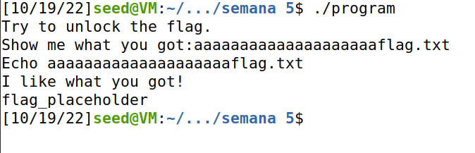
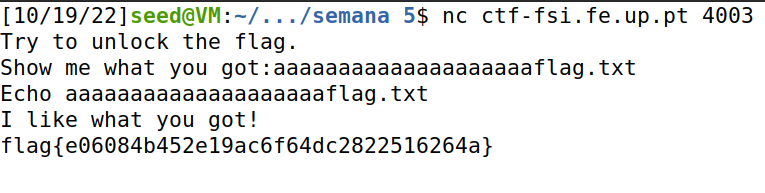
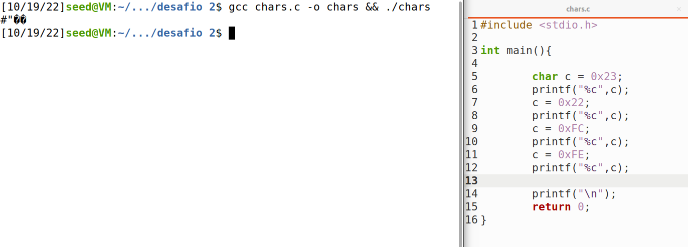
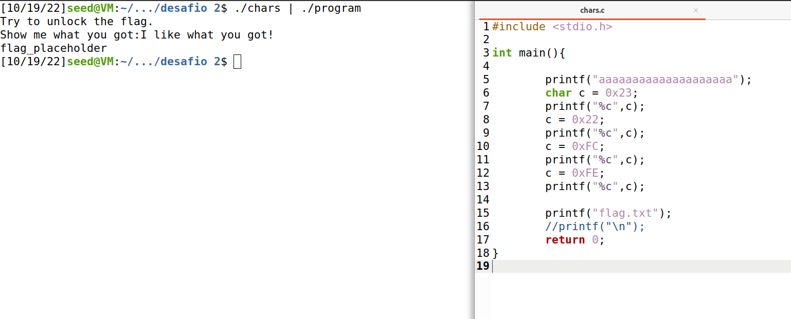
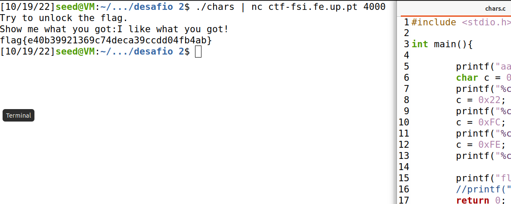

# Semana 5

## Desafio 1

Analisando o ficheiro .c percebemos que estas 4 linhas de código sao críticas:

```C
    char meme_file[8] = "mem.txt\0";
    char buffer[20];
    scanf("%28s", &buffer);
    FILE *fd = fopen(meme_file,"r");
```

O conteudo de um ficheiro especificado na varíavel meme_file é printado.
O scanf permite overflow e escrever no buffer e os bytes overflow vão parar ao mem_file array na stack.
Assim, se conseguirmos preencher o buffer[20] e depois alterarmos o mem_file[8] para conter "flag.txt" conseguimos forçar o programa a abrir e ler os conteudos de um ficheiro que desejamos. Noutras palavras, forçar o programa a dar nos a flag em flag.txt!

Vamos usar 20 chars aleatórios e de seguida a string "flag.txt".
Os 20 "a" ocupam o buffeer[] e a parte "flag.txt" será guardada no meme_file, rederecionando o programa para ler e printar o flag.txt.

Input para gerar overflow e adquirir a flag: **aaaaaaaaaaaaaaaaaaaaflag.txt**





## Desafio 2

Neste caso, foi adicionado um valor entre o meme_file e o buffer que serve como verificação para possíveis rescritas, sendo este valor impossível de escrever com o teclado &rarr; temos de arranjar maneira de rescreever os dados do meme_file e garantir que ```if(*(int*)val == 0xfefc2223)``` se verifica para o conteudo do ficheiro escolhido em meme_file seja printado.

```C
    char meme_file[8] = "mem.txt\0";
    char val[4] = "\xef\xbe\xad\xde";
    char buffer[20];
```

Portanto, temos de dar overflow e escrever nos 3 arrays e garantir q o val[] tem o valor hexadecimal 0xfefc2223 para a condição no if clause se verificar e o programa nos mostrar a flag.

A ideia é esta (tendo em conta a ordem de escrita nos buffers):

meme_file[20] &rarr; *aaaaaaaaaaaaaaaaaaaa*
val[4] &rarr; *0xfefc2223*
meme_file[8] &rarr; *flag.txt*

Temos de descobrir como manter o hexadecimal. Tomando partido do ascii code, vamos procurar os chars cujo ascii seja o represendado pelos chars 0xFE 0xFC 0x22 0x23.

Usando um chars.c criado por nos para printar os chars, temos:



Assim o input a dar para ter overflow será **aaaaaaaaaaaaaaaaaaaa#"��flag.txt**

Como o terminal não lida corretamente com estes chars, temos de passar logo o output do ./chars para o ./program! Ficamos com isto:



Aplicando isto agora ao site, econtramos a desejada flag!


