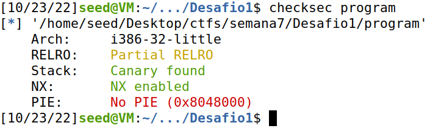
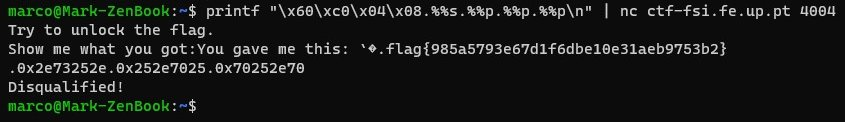
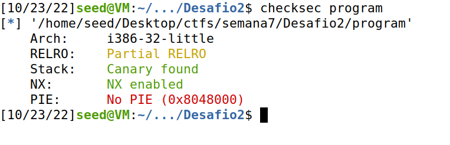
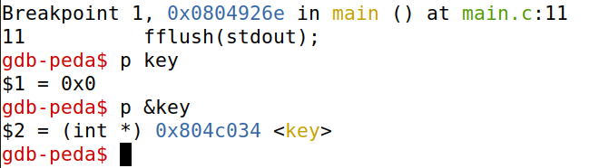
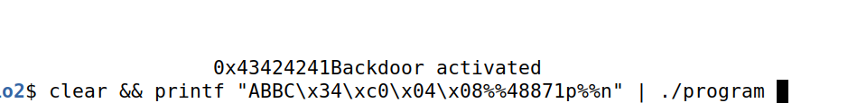

# Semana 7

## Desafio 1

Analizando o código, identifica-se rapidamente uma vulnerabilidade de string format. Vamos tomar partido disso para ler o conteudo desejado!



Vemos que o programa possui canários, limitando alguns tipos de ataque. Nota-se também que ão existe randomness dos endereços da stack, tornando fácil prever esses endereços e usar isso para um ataque.

Notar também que arquitetura é little-endian, pelo que endereços usados devem ser invertidos!

Usando o gdb para achar o endereço do que desejamos ler temos: x08 04 c0 60 &rarr; \x60\xc0\x04\x08

Com o endereço em mãos, podemos forçar o printf a mostrar o conteudo deste endereço específico.

Como só desejamos ler uma string, vamos guardar no buffer algo do género: `printf(ENDEREÇO_STR + %s)`

Após pouco tempo para perceber a dinâmica envolvida neste tipo de ataques, chegamos rapidamente à flag:



## Desafio 2

Para este desafio podemos seguir a mesma lógica e tomar partido de um format string para alterar a variável pretendida para 0xbeef e abrir um terminal para acedermos a flag.txt.



Para tal, teremos de manipular o valor guardado num endereço de memória e não apenas visualizá-lo. Para fazer isso, basta fazer recurso do %n que guarda num endereço o número de bytes já printados.

Como desejamos ter na variável 0xbeef, 48879 em base 10, temos de fazer print de 48879 chars. Isto é inviável considerando o tamanho de buffer.
Podemos tomar partido de formatadores de string:
%10s &rarr; imprime uma string com 10 espaços em branco à esquerda.



Sabendo o endereço da variável a alterar (0x0804c034), trata-se de aplicar a mesma lógica anterior com um %n porque queremos alterar e não apenas ler o conteudo do endereço alvo.

Temos de ter em atenção os caracteres já printados de forma a completar com o número correto de chars de padding. Após várias tentativas, chegamos a:

```sh
printf "ABBC\x34\xc0\x04\x08%%48871p%%n" | ./program
```



Conseguimos abrir a backdoor! Agora temos uma shell e basta ler a flag do flag.txt com `cat flag.txt`.
