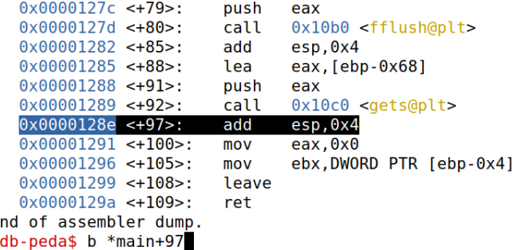

# Semana 8

## Desafio 1

No primeiro desafio deparamo-nos com um site no qual temos de fazer login como admin.

Olhando para o código identificamos rapidamente uma vulnerabilidade:

****

É possível fazer uma SQL injection!

Vamos testar num ambiente isolado para ver o que podemos fazer!
Após pouquíssimos tentativas vemos algo que funciona:

Basta agora fazer login com um username qualquer e com a password `'or username='admin`

## Desafio 2

### Identificação

Começando por observar o código fonte, identificamos rapidamente que a função insegura `gets()` é o ponto de vulnerabilidade. 

Verificando informações sobre o executável temos:

Podemos concluir que um ataque de buffer overflow com stack execution é uma alternativa plausível. Vamos então explorar essa possibilidade.

Vamos usar o gdb para analisar o código.
Começamos por analizar o main com `disas min`.
Vamos adicionar um breakpoint logo depois do `gets()` para ver como a stack fica logo depois desta função e imediatamente antes do return do main.

Vamos brincar um pouco com diferentes quantidades de chars de input e observar o comportamento da stack.

Os endereços que neste momento nos interessam são os que ficam abaixo dos 'A's que adicionamos ao buffer. Temos dois endereços `0x00` e depois dois endereços com conteudo. 

Tendo em conta como funciona a stack, um destes deve corresponder ao endereço de retorno da função main para terminar o programa. Vamos averiguar:

Está claro que o valor `0Xf7debee5` (apontado por $eip) corresponde ao valor de retorno da função main.

### Exploit

O plano de ação vai ser o seguinte:
- Encher o buffer de NOPS (0x90)
- Inserir no meio desses NOPS um binário shellcode
- Alterar o endereço de retorno da função main para um valor no meio dos NOPS que metemos na stack através de buffer overflow

Com isto, o programa vai atinngir o endereço de retorno de main, saltar para o meio dos nossos NOPS e continuar a subir a stack até atingir o nosso shellcode e executá-lo, abrindo uma shell. Com a shell podemos fazer `cat flag.txt`.

> Nota: Para o ataque foram usados 2 python scripts que se encontram disponibilizados mais para o fim deste relatório.

Vamos tentar primeiro atacar no gdb, começando por encher tudo de NOPS e alterar o endereço de retorno para um valor no meio dos NOPS:

> Nota: "badfile" corresponde a um ficheiro com conteudo binário e que é criado por um dos python script

O endereço de retorno que inserimos (`0xffffd104`) é calculado através da base do buffer mais um offset de alguns bytes para garantir que o endereço aponta para o meio dos NOPS.

O endereço do buffer no gdb é:

> Nota: Para evitar randomness no endereço do buffer nos testes intermédios foi usado o seguinte comando:
> sudo sysctl -w kernel.randomize_va_space=0

Voltado ao exploit, já temos os NOPS e um return address que aponta para o meio desses NOPS. Falta agora adicionar um shellcode encontrado na web:

Está tudo preparado! A parte amarela indica o shellcode inserido e a azul temos o endereço de retorno que substituimos e que nos manda de volta para o meio dos NOPS que pusemos no buffer.

Se continuarmos o programa:

Para gerar o badfile foi usado este script:

O objetivo foi alcançado no gdb! Agora é hora de transpor este ataque para o executável real.

Como o endereço vai mudando, temos de fazer um python script que comunique com o servidor, intersete o endereço do buffer dito pelo servidor, gere o payload correto para dê overflow e dar setup corretamente dos endereços certos com os valores apropriados.

O script ligase ao servidor e recebe os seus conteudos até detetar que o servidor está prestes a dizer o endereço do buffer. 

Nesse momento lê o endereço e processa-o, gerando o badfile correspondente (basta usar o mesmo exploit script apresentando anteriormente alterando apenas o buffer address usado para calcular os offsets).
Assim que o badfile esteja pronto, é enviado para o servidor!

Executando o script python final no servidor, conseguimos criar uma shell prompt sobre a qual temos total controlo:

Conseguimos com sucesso fazer buffer overflow e correr um shellscript através do qual conseguimos, por fim, ler a flag contida em flag.txt.
