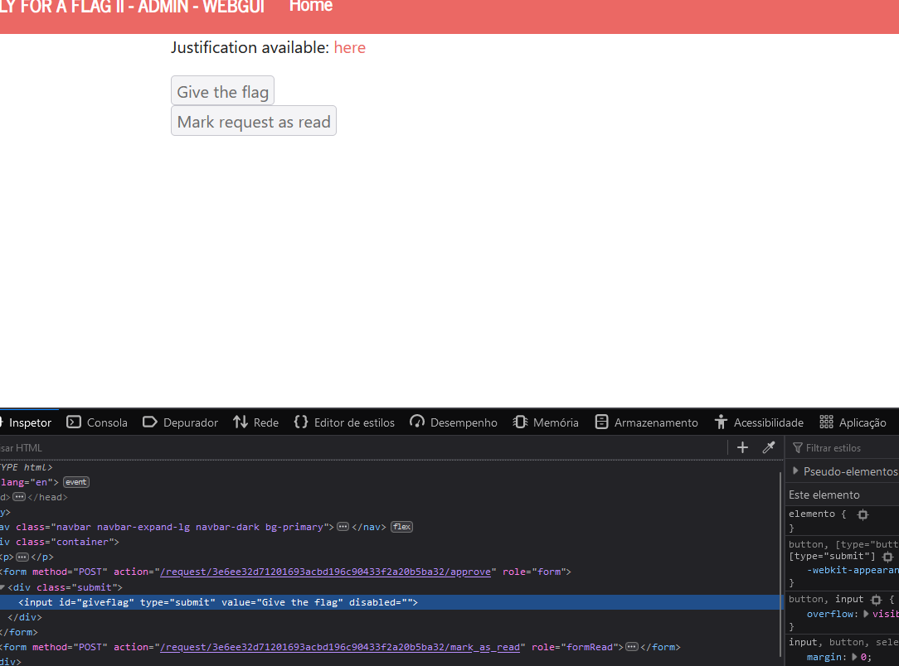
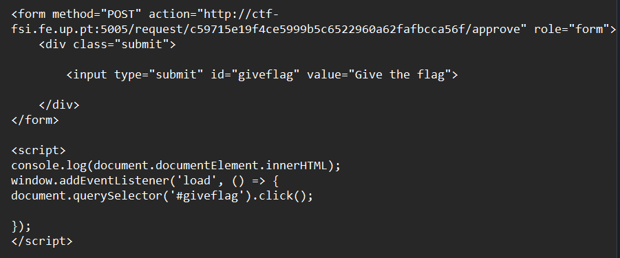
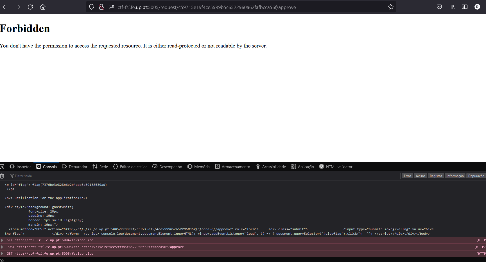

# Apply for flag

## Pesquisa

É notável que nos é fornecido um id para o request que deverá obviamente ser usado no exploit. Ao ir à página do admin notámos qual é a forma desse request e como deve ser feito.

## Exploit

Uma primeira exploit que se pensou foi chamar a função fetch de js para dar approve do nosso pedido. Porém essa solução não resultou devido ao cors e possivelmente pela falta de algum header no pedido.

Numa segunda abordagem experimentámos fazer o mesmo exploit dos CTFs da semana correspondente, com uma pequena variante. Acrescentámos ao dom o botão presente na página de admin na porta 5005 (com o id do request correspondente). Assim, quando o admin estiver a ver o nosso pedido irá efetuar o pedido de approve e consequentemente dá-nos a flag.

Um problema desta abordagem é que não conseguiríamos ver a flag pois seriamos redirecionados para o post de approve (que dá o erro 403 por ser forbidden). Resolvemos esse problema ao darmos print do dom, estando agora a flag disponível na consola do browser.

Note-se a flag presente na consola

