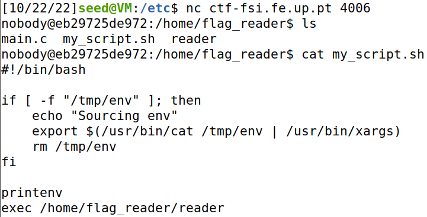
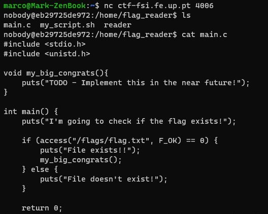
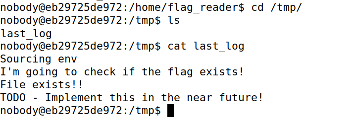
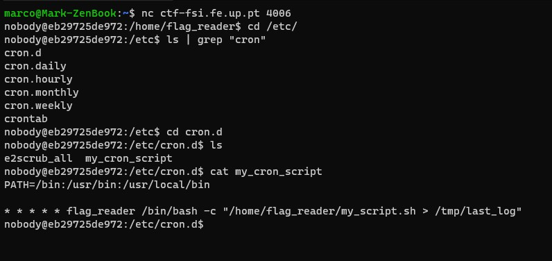
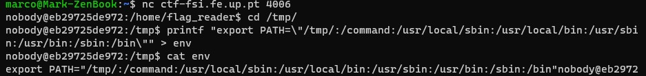
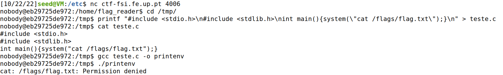
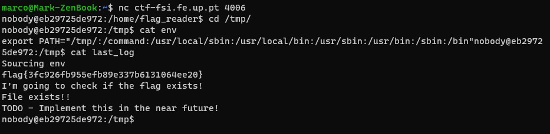

# British Punctuality

## Pesquisa

Aceder ao terminal remoto através de: `nc ctf-fsi.fe.up 4006`

Deparamo-nos no diretório `/home/flag_reader` que contem 3 ficheiros:

- *main.c*
- *my_script.sh*
- *reader*

Ao fazer cat do ficheiro `main.c` temos acesso ao código fonte onde se vê uma tentativa de reedirecionamento para `/flags/flag.txt`.
Ao tentarmos aceder ao ficheiro onde, em princípio, estará a flag, deparamo-nos com permissão negada...
Vamos voltar a analisar o `my_script.sh` e nota-se que conseguimos mudar as variáveis de ambiente caso criemos um ficheiro `/tmp/env` visto o `my_script.sh` procurar lá variáveis de ambiente.
Mais, note-se que este script chama `printenv` pois isto será importante mais abaixo.
No caso de conseguirmos alterar as variáveis de ambiente, conseguimos pôr o `printenv` a executar código nosso!

Ao ir para o diretório `/tmp/` vemos que tem um ficheiro chamado `last_log`:

Parece que o `last_log` é o registo de output de uma chamada a `my_script.sh` e é invocado por algum processo com privilégios de acesso à flag visto conter a string "flag exists".
Após observar que o `last_log` vai sendo atualizado ao longo do tempo e após alguma pesquisa, descobrimos que o **cron**, um agendador de tarefas está a corre o `my_script.sh` que, por sua vez, corre o executável `reader` (presente no diretório onde começamos) e a guardar conteudos no tal `last_log`. É este o ponto de falha para a vulnerabilidade!

## Exploit

Começamos por criar um ficheiro `/tmp/env` ao qual o script `my_script.sh` vá buscar variáveis de ambiente. Lá adicionamos `/tmp/` como o primeiro local onde a PATH deve procurar por executáveis.

Agora basta criar um executável `printenv` que será encontrado pela PATH e executado pelo `my_script.sh`.
Poderiamos pôr outros códigos no ficheiro mas como estamos apenas focados em adquirir a flag, vamos usar um `cat` para dar print da flag com as permissões necessárias para tal.

Como seria de esperar, não temos permissões para executar o nosso executável `printenv` mas não há problema visto que o `my_script.sh` vai corré-lo por nós.

## Explicação do Ataque

Basta esperar um pouco para que o cronjob ocorra, fazendo com que o `my_script.sh` tente ler um ficheiro `/tmp/env`. Nesse ficheiro forçamos a PATH a procurar primeiro executáveis no diretório `/tmp/` antes de qualquer outro. Com isto adquirimos controlo do que a PATH vai usar. No final do `my_script.sh`, antes de chamar o `reader`, o código printenv é chamado. Como nós alteramos a PATH, o printenv vai ser primeiro procurado no `/tmp/`. Lá colocamos o nosso código que agora terá permissões para fazer `cat` do ficheiro que contem a flag: **flag{3fc926fb955efb89e337b6131064ee20}**.

