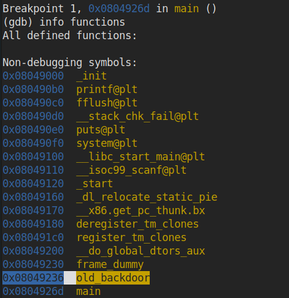
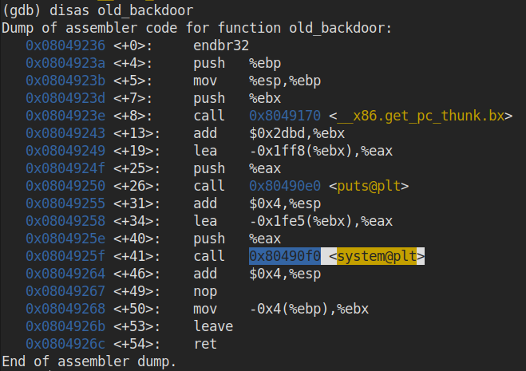
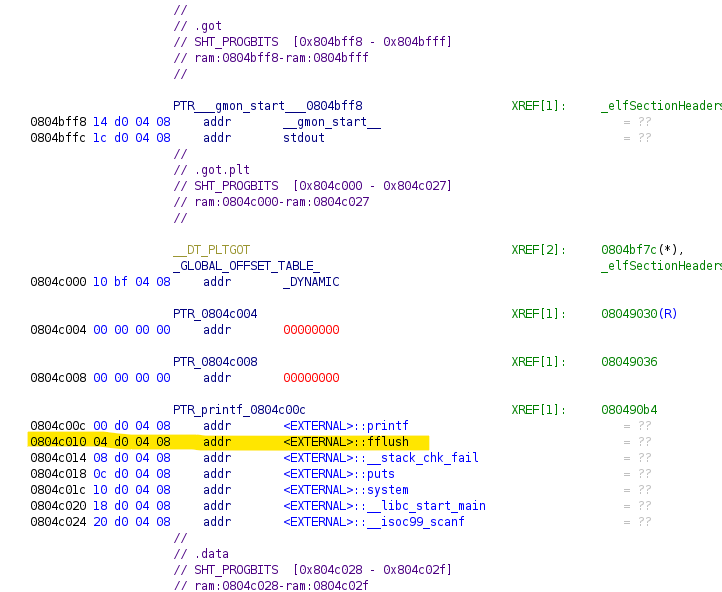
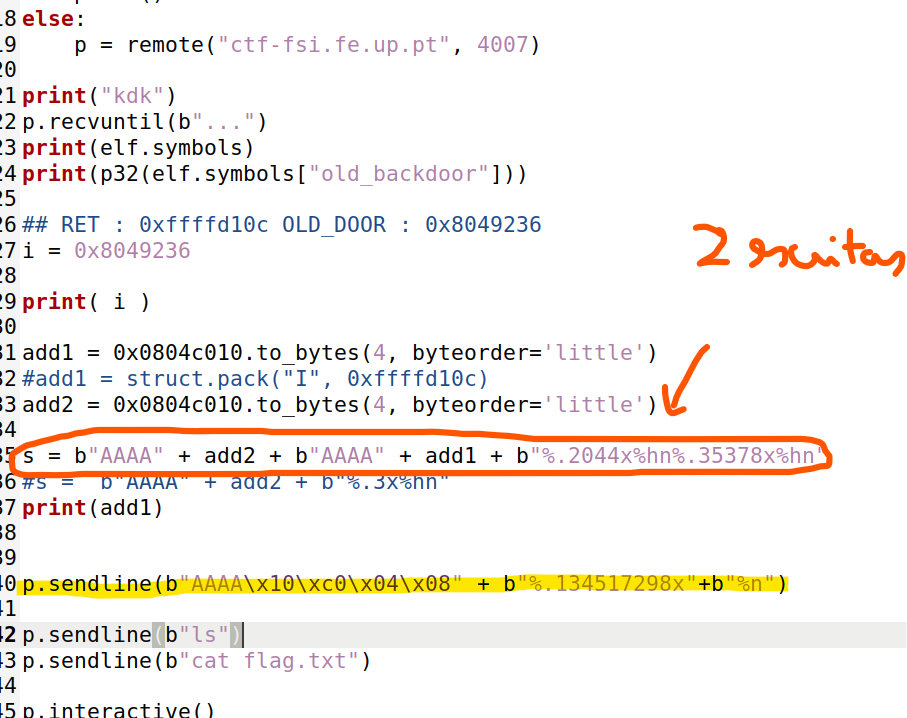
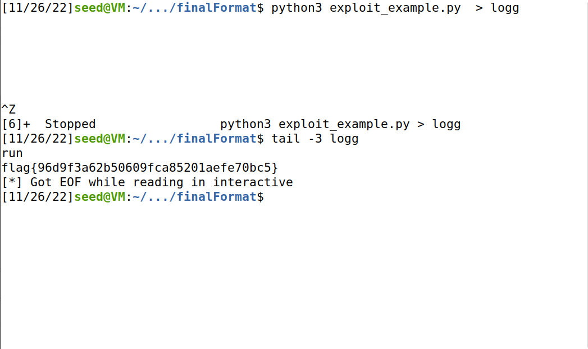

## FINAL FORMAT

Primeiras coisas a serem notadas usando GDB e um descompilador:

- O programa verifica se o endereço de retorno foi alterado pelo que uma possível solução não poderá passar por aí
- Existe uma função chamada de old_backdoor que lança uma bash, da qual podemos aceder à flag

Na lista de funções do executável a função `old_backdoor` chamou-nos logo à atenção.

Ao fazer disassamble dela, vemos que uma chamada system é feita. Mais especificament

Nota-se que a vulnerabilidade é semelhante ao dos ctfs da semana 7, na medida em que o printf é chamado sem string de formatação. Notou-se também que depois do printf é chamada a função fflush. Uma possível solução passa por alterar o endereço de retorno na tabela GOT para a função old_backdoor.

Descobre-se assim que a entrada na global offset table é 0x0804c010. Para esse endereço deveremos escrever 0x8049236 de forma a chamarmos a função old_backdoor ao invés da função fflush.

Poderia ser benéfico separar a escrita do endereço em duas partes, porém é possível chegar à solução somente com uma escrita.

Ao redirecionar o output para outro ficheiro conseguimos evitar os prints que são enviados do lado do servidor e assim aumentar a eficiência e clareza do exploit.

