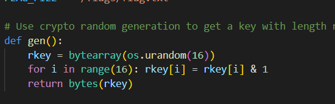
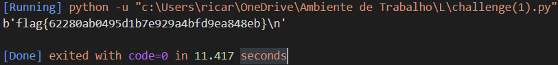

## Number Station

### Vulnerabilidade 

Primeiramente notou-se que a geração da chave de encriptação consiste na realização de um 'and lógico' com 1 de todos os bytes que são gerados aleatóriamente. 

Tal é uma vulnerabilidade pois baixa o número de possibilidades de chaves de 2^256 para 2^16. Esse valor é facilmente atingível por um computador pessoal.



### Exploit 

Para explorar a vulnerabilidade recorremos a um brute-force attack. Para tal gerou-se todas as possibilidades de chaves, e progressivamente verificou-se o output do decoding da flag dada pelo servidor. 

Geração de todas as possibilidades de chave:

```py
import itertools
import numpy
from ast import literal_eval

which = numpy.array(list(itertools.combinations(range(16), 2)))

grid = list(itertools.product([0, 1], repeat=16))
```

O grid gerado corresponde a um array de duas dimensões em que cada elemento do array corresponde a uma possibilidade de chave dividida por 16 colunas, representativas de cada byte da chave.
É então necessário passar essa representação para hexadecimal.

```py
def get_hex(value):
    convert_string = literal_eval(value)
    convert_hex = hex(convert_string)
    return convert_hex, convert_string

convert_to_key = lambda x: "0".join(map(str, x))
```

Agora é necessário percorrer cada array da grid, gerar a chave e dar decoding da flag com essa chave.
É normal que exista muita poluição uma vez que só uma das 2^16 chaves é a correta, para passar este problema apenas se dá print de decoding que começam por `flag`.

```py
for n in grid:
	convert_hex, convert_string = get_hex("0x" + convert_to_key(n))
	deco = dec(convert_string.to_bytes(16, byteorder='big'), unhexlify(f.encode()))
	if deco.startswith(b'flag'):
		print(deco)

convert_hex, convert_string = get_hex("0x" + convert_to_key(grid[0]))
```

Correndo a nossa exploit ...



#### Código completo

```py
# Python Module ciphersuite
import os
import sys
from cryptography.hazmat.primitives.ciphers import Cipher, algorithms, modes
from binascii import hexlify, unhexlify

FLAG_FILE = 'flag.txt'

# Use crypto random generation to get a key with length n
def gen(): 
	rkey = bytearray(os.urandom(16))
	for i in range(16): rkey[i] = rkey[i] & 1
	return bytes(rkey)

# Bitwise XOR operation.
def enc(k, m):
	cipher = Cipher(algorithms.AES(k), modes.ECB())
	encryptor = cipher.encryptor()
	cph = b""
	for ch in m:
		cph += encryptor.update((ch*16).encode())
	cph += encryptor.finalize()
	return cph

# Reverse operation
def dec(k, c):
	assert len(c) % 16 == 0
	cipher = Cipher(algorithms.AES(k), modes.ECB())
	decryptor = cipher.decryptor()
	blocks = len(c)//16
	msg = b""
	for i in range(0,(blocks)):
		msg+=decryptor.update(c[i*16:(i+1)*16])
		msg=msg[:-15]
	msg += decryptor.finalize()
	return msg

with open(FLAG_FILE, 'r') as fd:
	un_flag = fd.read()

k = gen()
print(hexlify(enc(k, un_flag)).decode())
sys.stdout.flush()


f = "3e32ddf287ad8b0b426a0a4908a90e26829e9aebf172b777c2b78b81af13661bd1cf01197222a89e1639a4c0f003d29a52d01eb9ca5edcbba5ff1a3ce01af465a5eb7c52eed1966f9d66a4473d3d745350da8357547c6dacb85df7e2ecc71cda0e59acec78176284139816448615e30d0e59acec78176284139816448615e30d635fd92c72f0b34ad8bf6ce0853ec9a96781a34582509b7811e02fc57f5d2c79d1cf01197222a89e1639a4c0f003d29af477ec0f7a6064ffaa7e39e8dc5ae2ee6781a34582509b7811e02fc57f5d2c7952e73a4ab2a1f522fd609de0cae6deb5759ec9a95d7b258296f7a70396e18a1ea1fd7b27b11a4b8cf7c4afa0ad9b9cd794f1adef9c9c439715097c69ec2dd6907e76adb5423d9708bc28c2c0093f0667f477ec0f7a6064ffaa7e39e8dc5ae2ee5778405605f3581db90f1e7ed729d858b76a942f9995c92d4900e7812d2874b3759ec9a95d7b258296f7a70396e18a1e0e59acec78176284139816448615e30d759ec9a95d7b258296f7a70396e18a1ed1cf01197222a89e1639a4c0f003d29a52e73a4ab2a1f522fd609de0cae6deb5f477ec0f7a6064ffaa7e39e8dc5ae2ee3e32ddf287ad8b0b426a0a4908a90e2694f1adef9c9c439715097c69ec2dd690759ec9a95d7b258296f7a70396e18a1eb76a942f9995c92d4900e7812d2874b3d1cf01197222a89e1639a4c0f003d29a635fd92c72f0b34ad8bf6ce0853ec9a952e73a4ab2a1f522fd609de0cae6deb5635fd92c72f0b34ad8bf6ce0853ec9a9b76a942f9995c92d4900e7812d2874b3f477ec0f7a6064ffaa7e39e8dc5ae2ee76ea161db7e5eddc3031a23c7838b526427acce3be9617e3085a087f0f9e6600"


import itertools
import numpy
from ast import literal_eval

which = numpy.array(list(itertools.combinations(range(16), 2)))

grid = list(itertools.product([0, 1], repeat=16))

def get_hex(value):
    convert_string = literal_eval(value)
    convert_hex = hex(convert_string)
    return convert_hex, convert_string

convert_to_key = lambda x: "0".join(map(str, x))

ll = hexlify(enc(k, un_flag)).decode()

print(dec(k, unhexlify(ll.encode())))

print(len(grid))

for n in grid:
	convert_hex, convert_string = get_hex("0x" + convert_to_key(n))
	deco = dec(convert_string.to_bytes(16, byteorder='big'), unhexlify(f.encode()))
	if deco.startswith(b'flag'):
		print(deco)

convert_hex, convert_string = get_hex("0x" + convert_to_key(grid[0]))


```


