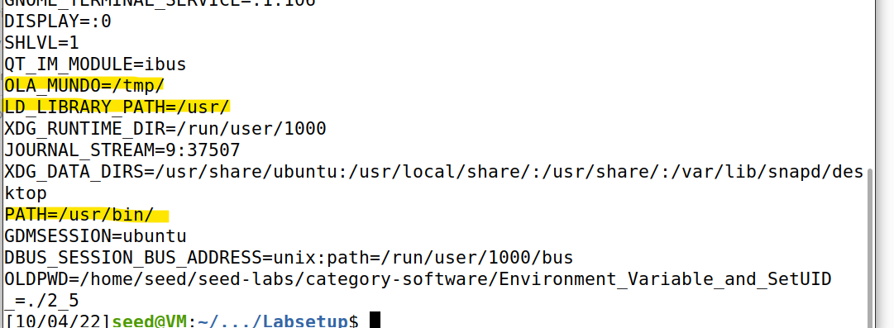

# Aula 4

## 2.1

Comandos úteis relativamente a variáveis de ambiente:

- printenv / env &rarr; print de todas as var de ambiente
- unset VAR &rarr; remove uma var de ambiente
- export VAR="VALUE" &rarr; atribui um novo valor a uma var de ambiente

**Nota:** Se fecharmos o terminal, as variáveis são perdidas, pelo que se conclui serem únicas da sessão do terminal.

## 2.2

O programa dá print das variáveis de ambiente do processo filho.

Ao analisar o ***man fork*** descobrimos que processos filhos herdam as suas variáveis de ambiente dos seus pais por defeito.

O código ***myprintenv.c*** confirma-nos isso ao guardar as variáveis de ambiente do pai e filho num ficheiro.

Usando ***diff env_parent env_child*** onde *env_** representam os ficheiros de output de ***myprintenv.c***, vemos que não possuem diferenças. Isto é, as variáveis de ambiente de processo pai e filho são as mesmas.

## 2.3

Funções da família do ***execve()*** envocam um novo programa matando o processo pai (substitui-o).

Inicialmente nada acontece mas depois de trocar a var passada por argumento, ja conseguimos ver na consola as variáveis de ambiente.

Assim, ao contrario do ***fork()*** q passa por default as env variáveis para o processo filho, *execve()* necessita de as receber como argumento.

Esse argumento é um array de variáveis de ambiente e que vem de : 
> "extern char **environ;"* (presente nos #include)

## 2.4

Comprova-se que ao usar **system()**, as variáveis de ambiente do processo são passadas ao novo programa shell (/bin/sh).

**NOTA:** No exercício 2.6 existe uma captura de ecrã que mostra este comportamento.

## 2.5

Programas **Set-UID** podem ser bastante perigosos e permitir, por exemplo, escalação de privilégios visto herdarem os privilégios do seu owner.
Se o owner de um executável for o root, esse executável terá permissões root independentemente se for executado por um user padrão.

Explicação dos comandos:

- *sudo chown root FILE* &rarr; Ficheiro passa a ser propriedade do root
- *sudo chmod 4755 FILE* &rarr; 755 define permissões de RWX e "4" ativa flag "setgid" para tornar programa Set-UID.

**Nota:** Para ver as permissões usar *"ls -l"*, obtendo o seguinte output:

> -rwsr-xr-x 1 root seed   164 Oct  3 06:36 2_5.c
> 
&rarr; Notar o "S" para indicar programa Set-UID (também evidenciado pela cor vermelha no terminal)

Depois de alterar as permissões e ownership do executável, alteramos novamente as variáveis de ambiente usando "export".
De seguida executamos o programa e verificamos que está a ser executado com privilégios root usando as nossas variáveis de ambiente!

Assim, encontra-se um possível ponto de ataque: variáveis de ambiente alteradas por nós numa sessão da shell podem ser utilizadas por programas (e em especial, com privilégios root).

Surpresa! Nas variaveis de ambiente aparece o autor como sendo o seed e não o root




**Resumo:**
*Calling system() within a Set-UID program is quite dangerous because the behavior of the shell program can be affected by environment variables, such as
PATH and these environment variables are provided by the user, who may be malicious.*

## 2.6

O comando que permite *adicionar* um novo diretório à PATH é **```export PATH=/home/seed:$PATH```**

A função **```system()```** já é perigosa mas torna-se ainda mais crítica se for usada uma path relativa como **```system("ls")```** visto podermos criar um executável com o nome ls e alterar a PATH para ir buscar o nosso código malicioso.

Resposta a questões propostas:

- É possível correr código malicioso
- O código porém não corre em root, provalvelmente por causa da tal defesa presente na nota


Versões mais recentes de Ubuntu têm uma defesa extra contra o problema identificado em 2.5 impedindo a shell de se executar em Set-UID.

Usando o comando /bin/zsh para entrar num terminal emulado de uma versão mais antiga de Ubuntu que ainda não tem a correção acima mencionada, podemos executar codigo da nossa autoria &rarr; código com potencial malicioso a correr em modo Set-UID!
