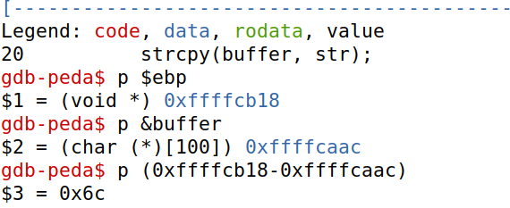
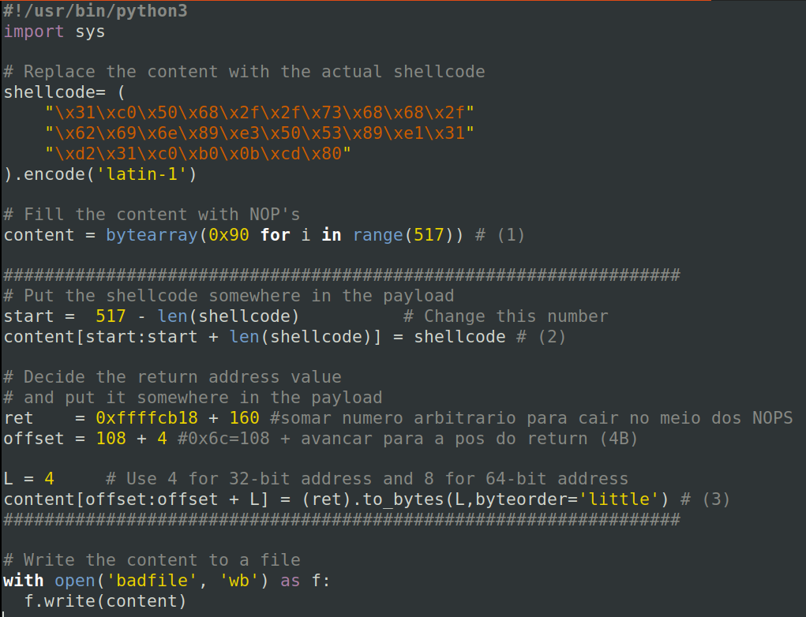

# Semana 5

## Task 1

O primeiro passo é desativar random addresses da stack para ser mais fácil saber o seu endereço e atacar.

Como dash e bash têm proteções contra correr em modo SET-UID (removendo imediatamente os privilégios), vamos usar a shell */bin/zsh* para facilitar este passo.

**StackGuard** e **Non-Executable Stack** são outras medidas de proteção contra as quais devemos trabalhar para executar um ataque.

Para conseguir efetivamente atacar, teremos de usar código assembly representado em binário.

É-nos fornecido um assembly code que passa os argumentos e usa a função *execve()* para chamar a shell */bin/zsh* que vamos usar para o ataque.

Temos também de estar atentos à arquitetura do alvo (32 ou 64bits) e usar o código assembly correto.

É nos igualmente fornecido o código binário representativo dos códigos assembly para ambas as arquiteturas de 32 e 64 bits.

```C
char code[500]; // criar buffer para colocar o nosso binário
strcpy(code, shellcode); // Copy the shellcode to the stack
int (*func)() = (int(*)())code; // criar func pointer para conseguir executar o binário que inserimos na stack como uma função "func()"
func(); // executar o nosso código binario presente na stack
```

Compilando e executando o código fornecido (call shellcode.c), conseguimos pôr o binário do nosso assembly na stack e executá-lo, criando uma nova shell dentro da nossa shell.

Tal execução de código só é possivel porque o executável foi compilado com a flag *"execstack"* que permite execução de código na stack.

## Task 2

O programa *stack.c* está vulneravel por causa de um *strcpy* com possibilidade de overflow do buffer. Ao ser compilado origina executáveis SET-UID.
Assim, se conseguirmos um exploit deste buffer overflow, o SET-UID permite-nos escalar privilégios!

O ficheiro usado para input ("badfile") é controlado pelo user, pelo que podemos tentar manipular o ficheiro para que ao ser lido para o buffer seja possível chamar uma root shell nossa.

Não esquecer de desativar **StackGuard** e **Non-Executable Stack** usando flags especiais ao compilar stack.c!

Tal como visto na aula anterior, um ficheiro pode ser transformado em SET-UID usando *"chown root FILE"* e *"chmod 4755 FILE"* para transferir propriedade para o root e adquirir as permissões necessárias no ficheiro, respetivamente.

Quatro ficheiros são gerados para diferentes tamanhos de buffer. Assim o nosso ataque tem de se adaptar para conseguir ser consistente nos ataques perante diferentes buffer sizes!

## Task 3

Para criar um exploit, precisamos saber a distância entre a posição inicial do buffer e o sitio onde o return-address se encontra. Vamos então analisar usando debug.

Combinando "gcc" com a flag "-g", gera-se ficheiros de debug que podem ser analisados com o comando "gdb".

Usando o gdb (GNU Debugger), conseguimos obter os endereços usados pelo programa.

Temos de ter cuidado ao fazer o nosso ataque porque o gdb manda alguma informação de ambiente para a stack em modo debug, pelo que o valor do frame pointer será ligeiramente diferente na prática (maior).

Os valores obtidos são:



Vamos usar um python script para preparar um payload (o conteudo do badfile) para o nosso exploit de buffer overflow.

O shellcode a usar tem relação com a arquitetura (32b vs 64b).
O content enche o buffer do ficheiro de 517 posições com NOP (0x90) com exceção para um espaço para o endereço de retorno que vamos manipular e o espaço para guardar o nosso código malicioso que está na variável shellcode.

### Como construir os endereços a usar no ficheiro python para o ataque

-Vamos colocar o código hexadecimal para executar a shell no final destes 517 bits, portanto temos 517-len(shellcode).

- O offset será a diferença calculada entre a base do buffer e a posição do frame pointer FP e que é de 0x6C ou 108 em base 10 (como se vê na iamgem acima). Como queremos a posição logo acima do FP para escrever no endereço de retorno, adicionamos mais 4 bytes (em 32 bits de arquitetura).

- Por fim, o endereço de retorno será a soma entre o FP e um número arbitrário. Porquê? Para forçar o programa a retornar para uma posição acima do FP na stack e que seja no meio dos NOP para o programa os ignorar e continuar a subir na stack até atingir o nosso código malicioso na stack para chamar uma shellcode.

- Após várias tentativas, chegamos à conclusão que somar 160 ao FP permite executar este ataque!

Em baixo pode ver-se o ficheiro python finalizado:


