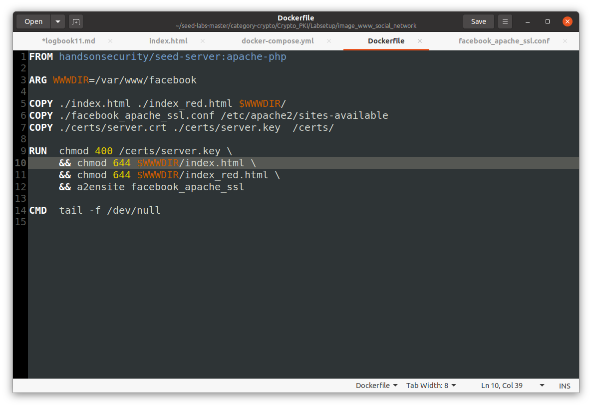

# Certificate Authority

## Task 1

The first step is to copy the openssl.cnf file to our current directory, and change the [CA_default] section according to the new settings.

After, we create a folder demoCA and create both the index.txt and the serial file inside it, as well as the required empty folders.

The pass phrase will be: super_secure_ca

Now, we can create a ca certificate using the command:

```
openssl req -x509 -newkey rsa:4096 -sha256 -days 3650 \
 -keyout ca.key -out ca.crt \
 -subj "/CN=www.modelCA.com/O=Model CA LTD./C=US" \
 -passout pass:super_secure_ca
```

### What part of the certificate indicates this is a CA’s certificate?

We see that the one who issued this certificate is Model CA LTD.

### What part of the certificate indicates this is a self-signed certificate?

We can see that is is a self-signed certificate because the subject and the issuer are the same.

### Crop the certificate

 In the RSA algorithm, we have a public exponent e, a private exponent d, a modulus n, and two secret numbers p and q, such that n = pq. Please identify the values for these elements in your certificate and key files

**Public exponent e:** 65537 (0x10001)

**Private exponent d:**
78:c7:e4:0d:df:17:ab:14:4f:d1:4f:ce:ab:93:63:
    21:e2:11:5d:63:bc:2b:f9:fd:d3:15:11:a1:30:e8:
    be:fd:d5:09:21:3f:b0:3b:60:4d:39:56:6b:f1:7e:
    af:d3:d1:9a:43:57:ab:90:3c:5e:07:81:ab:56:25:
    44:98:42:b4:85:42:0e:b0:61:0c:26:89:c8:89:4f:
    bf:ee:6a:9c:78:29:b8:e8:42:ed:b0:d7:3a:98:fe:
    2f:0e:d3:00:f8:8b:76:b4:de:fe:82:9d:fe:f0:98:
    a3:4e:47:27:76:49:43:7c:35:70:e3:f6:4f:25:8f:
    1e:50:e0:e0:5a:fd:56:f1:9a:a4:62:5b:3f:ba:5f:
    75:e1:60:74:3e:da:35:ca:73:88:2b:1d:28:7d:75:
    cc:c5:72:b7:0b:05:43:91:04:c5:c0:25:6a:98:97:
    83:88:25:82:03:f5:7b:c4:f6:4c:08:f6:55:7f:da:
    4b:e9:06:e6:48:4f:ec:93:06:85:ff:d8:13:91:74:
    50:49:6c:34:c8:1b:8b:96:6c:cf:42:59:fc:35:86:
    b0:8f:36:e2:e1:66:c2:68:ac:53:da:0e:24:81:f7:
    eb:e8:f4:c7:8e:af:2f:95:ff:b1:45:65:fb:b4:42:
    b4:6d:aa:df:02:e0:ed:16:d0:d3:cb:25:2e:ed:c3:
    c2:d9:c5:eb:07:48:a3:96:bd:43:3f:12:3d:1e:56:
    ba:83:2c:f0:3a:64:aa:08:18:d0:50:81:8e:c8:49:
    d0:3a:2c:6f:7a:c6:94:d3:82:33:b2:60:44:b4:dc:
    8d:41:37:1d:13:be:5a:8a:44:16:f9:84:da:35:1e:
    5c:03:51:60:8d:2a:7e:91:32:7c:f3:5f:88:59:26:
    49:6c:4d:9c:01:7a:66:72:96:a4:8c:1c:52:70:e9:
    64:db:7c:65:c1:e1:4d:46:f1:b1:51:83:39:f5:b3:
    ef:ea:97:fc:51:7e:e1:ea:46:2a:30:f1:f8:f6:10:
    9b:90:b3:72:9d:a0:c1:85:90:89:ee:a1:aa:15:f4:
    24:64:e3:83:04:c1:bf:0d:77:85:3a:b6:dd:01:64:
    4e:e4:dc:5e:2d:32:44:98:20:6d:84:e4:44:d1:c6:
    e6:f8:f8:f0:ab:df:19:df:bc:51:71:b0:06:15:e5:
    3c:25:26:2b:cd:60:1a:b3:1c:31:3b:b7:22:26:a9:
    e4:88:3b:ca:59:96:5e:ee:ec:37:f0:c8:d4:9d:37:
    2c:e4:33:b4:f0:78:d3:dd:7d:82:4b:39:c9:3f:77:
    dd:b2:74:d4:2d:79:b3:08:bd:ee:25:28:2b:a9:1f:
    54:da:17:2d:b4:19:64:75:a3:4d:0e:f4:20:d2:cd:
    5d:a1

**Modulus n:**
    00:cd:55:6b:27:36:e7:08:31:cc:51:c2:14:ed:6e:
    d3:3c:95:ad:4e:5a:c6:9b:e2:af:bf:4f:dd:b8:e8:
    70:33:78:2f:1d:9e:99:69:1d:d2:06:0a:69:09:c9:
    b2:42:58:1e:60:0e:c8:24:eb:fc:01:08:fd:52:9f:
    68:73:44:3f:ad:2d:36:c2:52:e6:ad:00:5f:16:cc:
    59:af:43:5d:fc:45:e6:cc:85:5f:0a:b0:a6:40:e5:
    07:d2:b7:89:6b:fd:0d:ed:61:b2:45:d8:36:4e:0f:
    1c:8a:8b:7f:86:db:2c:e3:c9:64:8f:a9:58:b3:6e:
    7a:15:10:7a:17:5f:dd:0e:59:a9:0b:d7:24:d1:16:
    5f:b5:34:54:c5:e3:98:10:49:96:89:3d:d5:7f:29:
    25:da:8a:93:44:9c:37:ee:9d:cf:fe:1e:c1:1a:9d:
    b7:cd:87:39:b2:19:ca:0c:87:01:a3:e6:c7:ed:c4:
    0b:d1:a4:ab:38:4b:7a:d8:96:42:a7:33:e0:bb:47:
    55:7a:4b:3a:bb:60:77:21:f2:7b:6c:25:32:42:bf:
    d4:7a:2c:ea:08:79:b8:dc:ff:e6:0d:30:e6:fb:42:
    5e:c9:f6:ae:55:f4:39:6a:e2:3b:41:ca:4f:b8:fc:
    56:47:e8:83:84:77:b1:29:3c:b8:e5:28:72:d1:93:
    07:c1:13:f1:c8:c1:fc:ba:2d:1e:dc:b2:6e:6c:eb:
    56:ea:11:d0:21:57:8e:82:d8:bf:e3:09:cd:1d:75:
    fc:26:5f:44:a2:aa:a1:88:da:b2:d8:e5:d6:82:d7:
    3b:bb:50:ab:19:58:77:52:90:af:a6:82:e6:32:5c:
    a4:63:fb:a4:77:5b:14:d5:72:33:72:2d:c9:69:ac:
    6e:0c:bf:b7:da:2e:0e:a9:fb:e6:6f:2c:c4:84:4e:
    77:7e:7b:71:0b:06:05:dc:12:7a:04:f0:b4:b0:c8:
    78:01:99:99:64:84:d0:f5:d7:6b:43:bb:92:90:4c:
    fd:e4:e9:72:31:fd:54:c2:54:ae:ca:da:90:0f:90:
    38:25:13:22:b5:4e:ad:a0:7c:08:e0:fc:67:77:6e:
    7f:80:9b:2b:09:cb:9c:6b:7d:0c:2e:87:c0:09:93:
    db:88:75:31:3c:c2:de:0d:eb:bd:e1:a0:3f:34:39:
    ce:4d:b7:c8:14:8e:a5:ef:d4:07:58:ad:2c:eb:f2:
    4a:b5:2a:63:a7:eb:53:29:37:f2:34:eb:be:69:4c:
    aa:cd:47:89:27:a5:92:fe:43:5f:4d:b0:e3:63:c7:
    a0:e5:d0:74:e7:7f:62:fe:af:2a:54:bd:91:a2:c9:
    ff:bf:41:b6:b7:9f:57:41:1a:7b:82:29:d9:48:12:
    11:95:2f

**prime1 (p):**
    00:ff:42:bd:ab:c9:0c:70:18:e2:ac:cf:bd:cc:fe:
    39:d9:e9:e4:63:fc:4b:73:15:10:52:88:63:70:0d:
    ed:f0:11:fe:97:4c:69:bb:76:25:e2:f0:51:c7:aa:
    19:aa:cc:11:92:5e:c7:0f:b6:64:7a:7f:51:23:2b:
    4f:14:db:14:c5:e1:2d:2d:43:96:c6:7e:f2:6a:d5:
    2e:6f:58:55:2f:4b:d8:3c:2d:a4:2e:a1:59:88:63:
    06:f9:31:f3:7d:91:84:5b:1b:da:7c:a6:65:1c:e9:
    7a:04:99:9b:5c:f0:7e:bc:a9:63:10:03:98:90:3f:
    9e:00:4f:a6:d8:37:f9:6c:c6:f1:71:fc:04:30:12:
    7f:f8:ce:73:33:7e:86:5b:fd:b4:13:e6:d0:e2:c0:
    b1:d0:cc:97:1c:06:67:57:1d:bd:40:f0:31:58:58:
    ab:13:13:5e:a6:a0:9a:d4:d6:46:e1:1c:01:9c:5e:
    7d:84:12:1c:93:83:f7:5d:a6:7e:dc:dd:20:88:84:
    8f:5c:76:42:42:d2:c1:de:dc:f8:01:d9:10:24:45:
    25:95:de:ab:f3:95:57:b7:16:b7:39:80:2e:b0:cd:
    7e:ae:c6:c8:19:6b:00:89:0b:81:71:fc:f0:7e:1e:
    10:5f:7f:43:8e:e8:95:95:b1:fd:bf:c6:10:86:9c:
    98:17

**prime2 (q):**
    00:cd:ed:a8:f7:f9:b9:d4:20:9e:8c:e5:16:78:91:
    80:31:79:8b:f0:d0:e3:85:0b:b5:65:1c:39:13:16:
    a8:b7:42:32:20:3a:77:e5:07:ec:8e:57:65:43:40:
    7e:88:87:b0:89:19:13:06:0c:b4:ff:ea:8a:67:62:
    18:e3:59:ce:f8:1a:10:d2:ab:6a:af:49:53:53:4c:
    0e:d7:28:e4:0e:7b:ca:65:cf:fc:f3:da:0c:8c:dd:
    52:e2:ce:bc:61:6d:30:85:65:85:a2:c3:5a:13:08:
    82:4e:46:ad:15:0c:8c:e0:e0:50:cc:4f:37:a5:ba:
    b8:53:5a:6f:b9:93:a2:04:02:41:91:32:16:c6:0a:
    74:9a:fc:b8:85:97:04:74:7f:21:93:db:f6:61:06:
    01:fb:94:e5:22:92:e8:e4:5a:a6:19:f9:a1:49:6b:
    31:37:75:0c:a8:0a:c8:53:03:e9:a6:d6:01:e6:2f:
    0d:7a:e5:b5:8c:d8:19:3f:0a:b7:e4:bc:73:76:f9:
    b9:92:b0:9e:07:61:26:24:07:78:fe:06:84:1c:16:
    2a:33:a2:5f:b9:2d:79:8f:c4:77:1e:04:1f:50:02:
    21:ee:dc:a1:4d:5b:e7:df:7b:b5:c0:04:6a:24:9a:
    0b:0c:28:c3:f4:f8:e6:4f:10:b6:e8:a3:b1:b0:27:
    02:a9

## Task 2

In order to generate a Certificate Signing Request we can use the following command:

```
openssl req -newkey rsa:2048 -sha256 \
 -keyout server.key -out server.csr \
 -subj "/CN=www.matosandrealves2022.com/O=MatosAndreAlves Inc./C=US" \
 -passout pass:super_secure_ca \
 -addext "subjectAltName = DNS:www.matosandrealves2022.com, \
 DNS:www.matosandrealves2022A.com, \
 DNS:www.matosandrealves2022B.com"
```

In here we also used the SAN extension to provide several hostnames in our certificate.

Both server.key and server.csr were generated:


## Task 3

Now, in order to for our CA to sign the CSR (server.csr) we can use de following command:

```
openssl ca -config myCA_openssl.cnf -policy policy_anything \
 -md sha256 -days 3650 \
 -in server.csr -out server.crt -batch \
 -cert ca.crt -keyfile ca.key
```

Now, we can just open the new generated server.crt file:


Or run the following command to check the information of the certificate:

```
openssl x509 -in server.crt -text -noout
```

And the result:


## Task 4

So, in order for use to host our own website we need to take a few steps.

First, of all, let's use the certificates that we have already generated in the previous tasks, and place them inside the certs folder.


Inside the folder, we now have the CA's public-key certificate and also both the public certificate signed by our ca, as well as our own website's private key.

We also need to change the apache ssl configuration file to this:


And now, we need to change the Docker file to this:


Now we can start our container (make sure there are not problems while building the container) and in our container, in order to start the apache server, we need to run the following command:

`service apache2 start`

Then, we need to insert our passphrase, and the website will start working


But the browser still warns the user, saying that the website is not secure.
In order to change that, we need to add our ca certificate to our browser.

If we type "about:preferences#privacy" in the address bar, and select View Certificates we can import our CA certificate.


After adding our own CA certificate to our browser, our website is no longer considered insecure by the browser.


## Task 5

In this task, let's start by hosting our fake social network website.

Our "fake" social network website will be: www.facebook.com

We need to change the docker file and the apache configuration file, just like in task 4, in order to host our website.

Dockerfile:



Apache configuration file:


If we go to our browser, and go to www.facebook.com, this is what we will currently see:


Now, let's simulate an attack on the DNS by changing the /etc/hosts file on our computer, and add the entry: 10.9.0.80 www.facebook.com


And now in our browser, if we go to <https://facebook.com> we can see that our website is considered unsafe by the browser:


This is because we don't have a certificate of our website signed by a ca.
Since the browser can't confirm the authenticity of our website, it shows a warning to the user. This way ca certificates can prevent MITM attacks.

## Task 6

If we have the private key of the ca, we can generate our own certificates, that are apparently signed by the ca.

Let's start by generating the cetificates, just like in task 2 and 3.

Generate the Certificate Signing Request:

```
openssl req -newkey rsa:2048 -sha256 \
 -keyout facebook.key -out facebook.csr \
 -subj "/CN=www.facebook.com/O=Facebook Inc./C=US" \
 -passout pass:super_secure_ca \
 -addext "subjectAltName = DNS:www.facebook.com, \
 DNS:www.faceboook.com, \
 DNS:www.facebooook.com"
```

Have our CA sign the CSR:

```
openssl ca -config myCA_openssl.cnf -policy policy_anything \
 -md sha256 -days 3650 \
 -in facebook.csr -out facebook.crt -batch \
 -cert ca.crt -keyfile ca.key
```

Now we need to change the docker file and the apache configuration file.

Dockerfile:


Apache configuration file:


Now, following the same steps as in the previous task, if we go to <https://facebook.com> we can see our website working


With this, we understand that it's extremely important for ca's to keep their key secure, otherwise, MITM attacks will not be prevented.

In a real attack, we could modify our page to look like facebook's real home page, in order to deceive the victims to give their passwords.
